# Architecture Diagrams

## System Architecture Overview

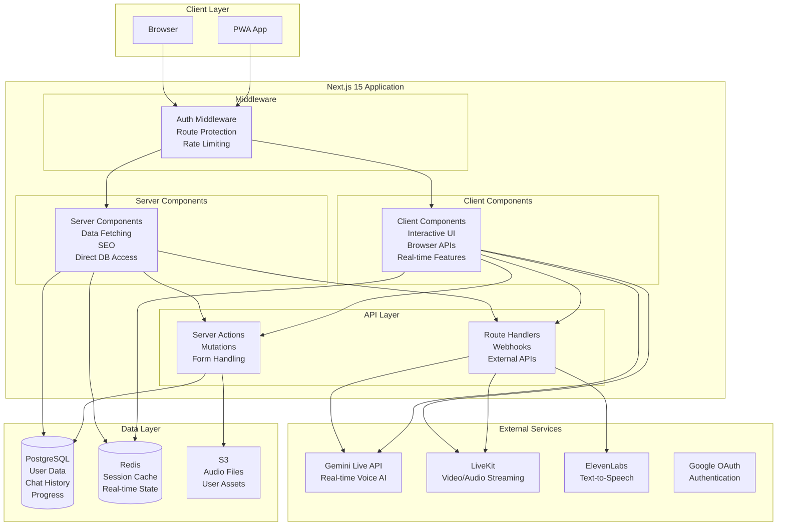

## Data Flow: Text Chat

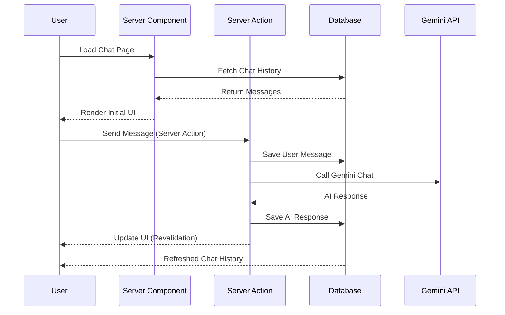

## Data Flow: Voice Chat with Gemini Live

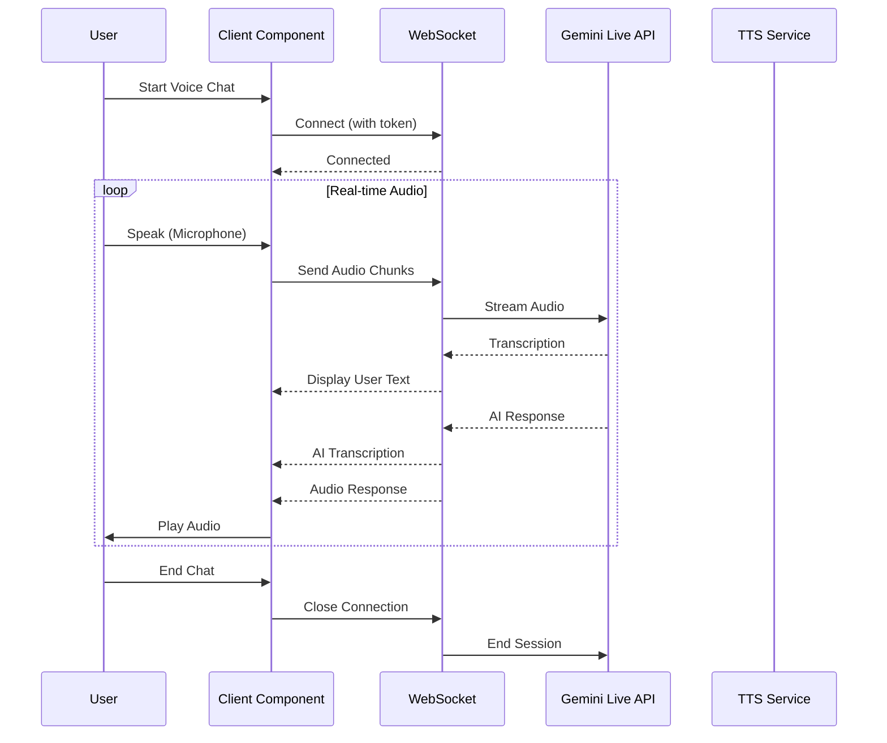

## Component Architecture

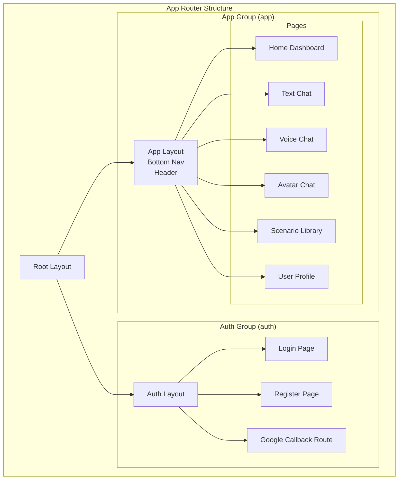

## State Management Architecture

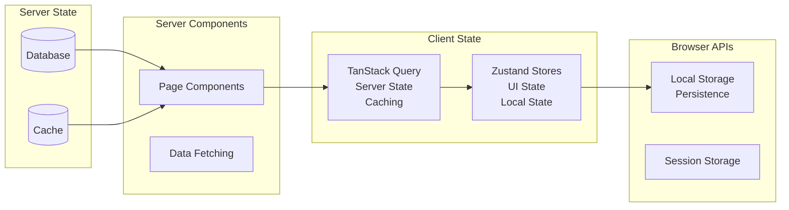

## Authentication Flow

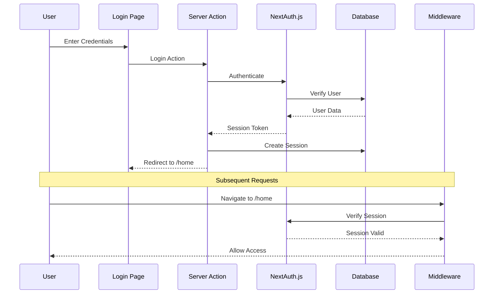

## Real-time Audio Processing

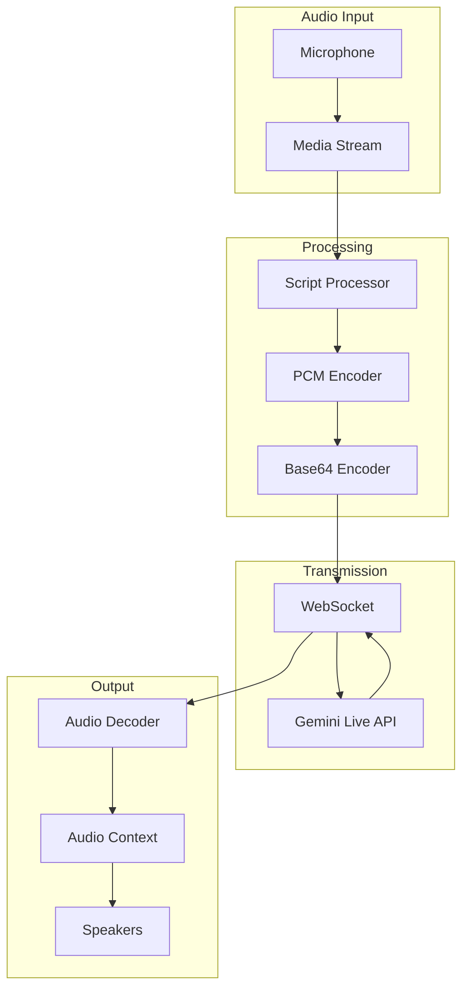

## Caching Strategy

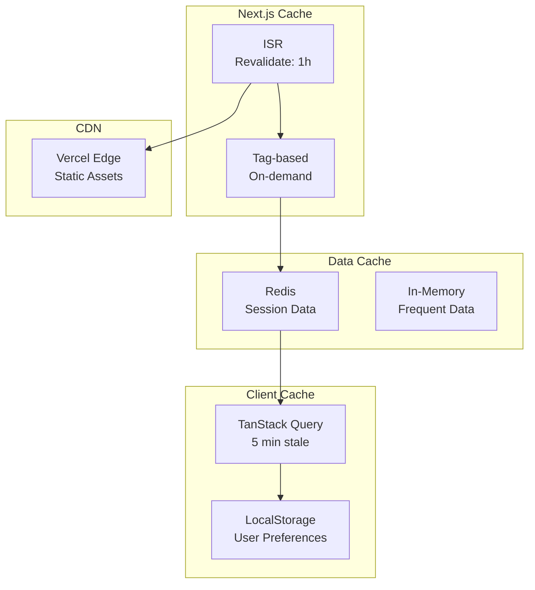

## Deployment Architecture

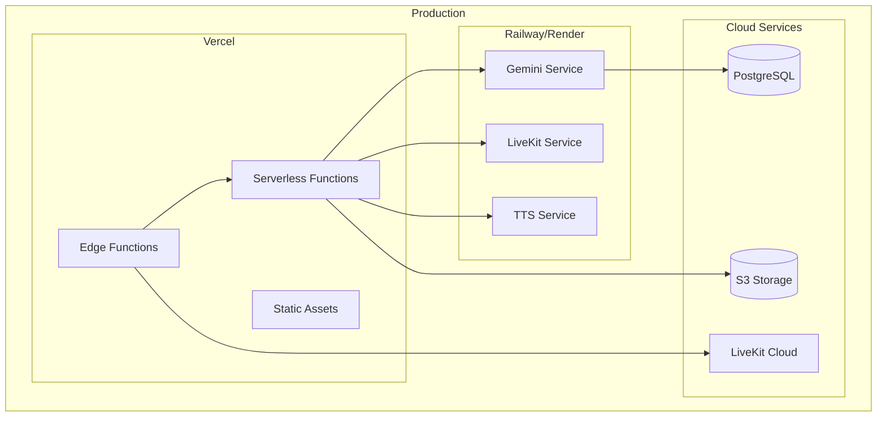

## Performance Optimization Layers

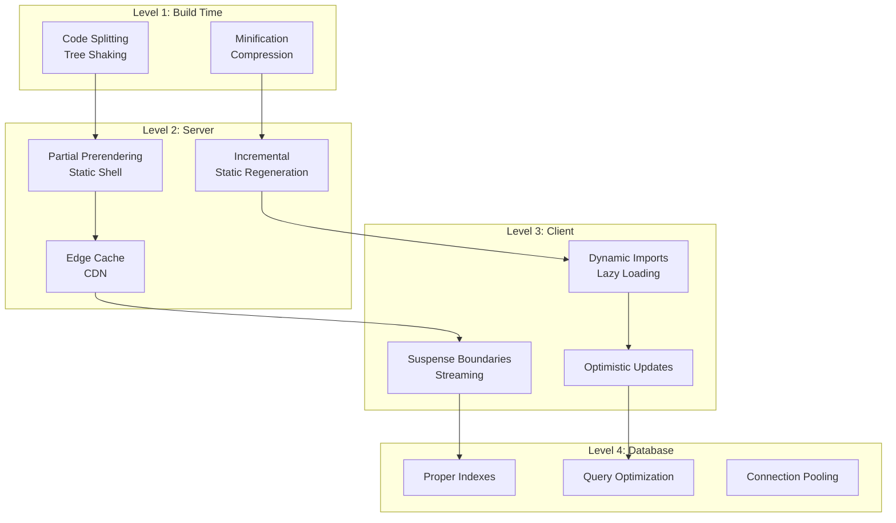

## Migration Strategy

```mermaid
graph LR
    subgraph "Phase 1: Foundation"
        P1A[Setup Next.js 15]
        P1B[Configure Auth]
        P1C[Database Schema]
    end

    subgraph "Phase 2: Core Pages"
        P2A[Migrate Layouts]
        P2B[Migrate Home/Profile]
        P2C[UI Components]
    end

    subgraph "Phase 3: Chat Features"
        P3A[Text Chat]
        P3B[Server Actions]
        P3C[Real-time Hooks]
    end

    subgraph "Phase 4: Advanced"
        P4A[Voice Chat]
        P4B[Avatar Features]
        P4C[LiveKit Integration]
    end

    subgraph "Phase 5: Polish"
        P5A[Performance]
        P5B[Testing]
        P5C[Deployment]
    end

    P1A --> P1B --> P1C
    P1C --> P2A --> P2B --> P2C
    P2C --> P3A --> P3B --> P3C
    P3C --> P4A --> P4B --> P4C
    P4C --> P5A --> P5B --> P5C
```

## Security Architecture

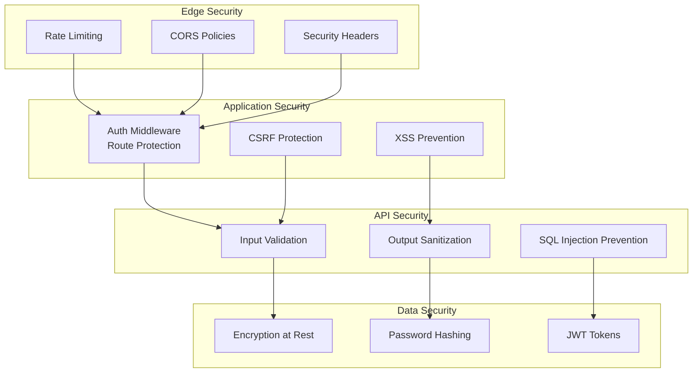

## Monitoring & Observability

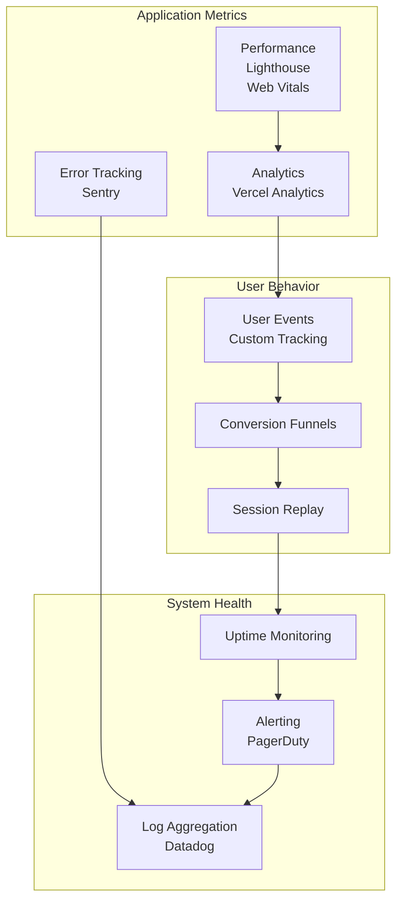

---

These diagrams provide a comprehensive visual representation of the Next.js 15 architecture for the SAke E-Learning platform, covering all major aspects from data flow to deployment strategy.
