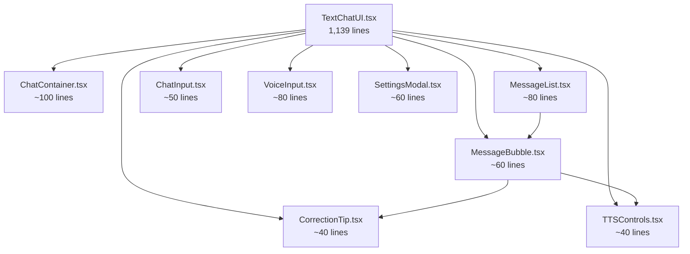

# React + Vite Refactoring Documentation

## 📚 Overview

This directory contains comprehensive refactoring documentation for **modernizing the SAke E-Learning V3 application while keeping the React + Vite tech stack**.

**Note:** For Next.js 15 migration documentation, see [README.md](./README.md)

---

## 🎯 Refactoring Goals

Modernize the codebase with 2025 best practices while maintaining:
- **React 19.2** + TypeScript
- **Vite** build tool
- **Tailwind CSS v4**
- **React Router v7** (HashRouter)

### Key Improvements

| Area | Before | After |
|------|--------|-------|
| Component Size | Up to 1,139 lines | < 300 lines |
| State Management | Mixed patterns | TanStack Query + Zustand |
| UI Components | Duplicated | Design system + tokens |
| Testing | None | 80%+ coverage |
| File Structure | Confusing | Feature-based |
| Code Quality | No linting | ESLint + Prettier |

---

## 📄 Documentation Index

### Core Documentation

#### [README.md](./core/README.md)
**Core documentation overview**

---

#### [core/REFACTORING_PLAN.md](./core/REFACTORING_PLAN.md)
**Complete 8-week refactoring roadmap**

**Contents:**
- 8-phase implementation timeline
- Testing infrastructure setup (Vitest, Testing Library, MSW)
- State management strategy (TanStack Query, Zustand)
- Design system with Tailwind CSS v4 tokens
- Component decomposition strategy
- Performance optimization techniques
- Success metrics and risk mitigation

**Key Highlights:**
- Target: All components < 300 lines
- 80%+ test coverage goal
- Zero ESLint/TypeScript errors
- Lighthouse score > 90

---

#### [core/LIBRARY_RECOMMENDATIONS.md](./core/LIBRARY_RECOMMENDATIONS.md)
**Detailed library justifications and comparisons**

**Contents:**
- Testing libraries (Vitest vs Jest, Testing Library, MSW)
- State management (TanStack Query, Zustand vs Redux)
- UI components (Radix UI vs MUI/Chakra)
- Forms (React Hook Form vs Formik)
- Validation (Zod vs Yup)
- Utilities (date-fns, clsx, tailwind-merge)
- Performance libraries (@tanstack/react-virtual)

**Key Highlights:**
- Bundle size impact analysis (~44KB total)
- Feature comparison tables
- Code examples for each library
- Migration patterns

---

#### [core/IMPLEMENTATION_GUIDE.md](./core/IMPLEMENTATION_GUIDE.md)
**Step-by-step quick-start guide**

**Contents:**
- Day-by-day implementation tasks (25 days)
- Copy-paste ready code examples
- Configuration files (vitest.config.ts, eslint.config.js)
- Component extraction examples
- Test writing examples
- Troubleshooting guide

**Key Highlights:**
- Phase 1: Foundation setup (Day 1-2)
- Phase 2: Code quality tools (Day 2-3)
- Phase 3: State management (Day 3-5)
- Phase 4: Design system (Day 5-7)
- Phase 5: Component decomposition (Day 7-14)

---

### Design & Configuration

#### [design/STYLE_GUIDE.md](./design/STYLE_GUIDE.md)
**Complete design system documentation**

**Contents:**
- Color palette (primary, secondary, accent, semantic)
- Typography scale and font families
- Spacing system (4px base unit)
- Border radius and shadows
- Component style patterns
- Animation and transitions
- Responsive breakpoints
- Dark mode support (future)

**Key Highlights:**
- Maintains current visual appearance
- Design tokens with Tailwind CSS v4
- Component examples (Button, Card, MessageBubble)
- Migration strategy

---

#### [config/REACT_CONFIG.md](./config/REACT_CONFIG.md)
**All configuration files for React + Vite**

**Contents:**
- package.json with all dependencies
- vite.config.ts with code splitting
- tailwind.config.js with design tokens
- TypeScript configurations (tsconfig.json)
- Vitest testing setup
- ESLint and Prettier configurations
- Environment variables template
- Git hooks with Husky
- Playwright E2E configuration
- MSW mocking setup

**Key Highlights:**
- Copy-paste ready configurations
- Production-ready settings
- Performance optimizations included

---

### Architecture & Testing

#### [architecture/ARCHITECTURE.md](./architecture/ARCHITECTURE.md)
**System architecture and component structure**

**Contents:**
- Current architecture analysis (TextChatUI: 1,139 lines)
- Target system design with Mermaid diagrams
- Component decomposition strategy
- Data flow diagrams
- Before/after file structure comparison
- State management patterns
- Testing strategy

**Key Highlights:**
- TextChatUI split into 8 components (~150 lines each)
- Feature-based module organization
- Component composition patterns
- Integration/E2E test examples

---

#### [architecture/REFACTORING_DIAGRAMS.md](./architecture/REFACTORING_DIAGRAMS.md)
**Visual architecture diagrams with Mermaid**

**Contents:**
- Current vs target architecture
- Component decomposition diagrams
- State management flow
- Data flow patterns
- Feature module structure
- Testing strategy pyramid
- Code splitting strategy
- Performance optimization layers

**Key Highlights:**
- Before/after comparisons
- Mermaid diagrams for all architectures
- Visual representation of changes

---

#### [testing/TESTING_GUIDE.md](./testing/TESTING_GUIDE.md)
**Complete testing strategy and examples**

**Contents:**
- Testing philosophy and pyramid
- Unit testing examples (components, hooks, utilities)
- Integration testing with MSW
- E2E testing with Playwright
- Testing best practices
- Coverage targets by category
- CI/CD integration with GitHub Actions
- Common issues and solutions

**Key Highlights:**
- Real-world test examples
- MSW handlers for API mocking
- Playwright E2E test scenarios
- Coverage targets: 80%+ overall

---

#### [performance/PERFORMANCE_OPTIMIZATION.md](./performance/PERFORMANCE_OPTIMIZATION.md)
**Performance optimization strategies**

**Contents:**
- Performance goals and budgets
- Current performance analysis
- Bundle optimization techniques
- Rendering optimization (React.memo, useMemo, useCallback)
- Code splitting strategies
- Asset optimization (images, fonts)
- Network optimization (caching, optimistic updates)
- Monitoring and measurement (Web Vitals, Lighthouse)

**Key Highlights:**
- Expected: -20% bundle size
- Virtual scrolling for long lists
- Performance optimization checklist
- Lighthouse CI integration

---

## 🚀 Quick Start

### Step 1: Read in Order

```
1. react-refactor/README.md (this file)     ← Start here
2. core/REFACTORING_PLAN.md                  ← Understand the plan
3. core/LIBRARY_RECOMMENDATIONS.md           ← Learn about libraries
4. architecture/ARCHITECTURE.md              ← See the architecture
5. core/IMPLEMENTATION_GUIDE.md              ← Start coding

Optional (deep dives):
6. design/STYLE_GUIDE.md                     ← Design system details
7. config/REACT_CONFIG.md                    ← Configuration files
8. architecture/REFACTORING_DIAGRAMS.md      ← Visual diagrams
9. testing/TESTING_GUIDE.md                  ← Testing strategy
10. performance/PERFORMANCE_OPTIMIZATION.md  ← Performance guide
```

### Step 2: Install All Dependencies

```bash
# Testing
npm install -D vitest @vitest/ui @testing-library/react @testing-library/jest-dom @testing-library/user-event jsdom msw @playwright/test

# State Management
npm install @tanstack/react-query zustand

# UI Components
npm install @radix-ui/react-dialog @radix-ui/react-dropdown-menu @radix-ui/react-tabs @radix-ui/react-tooltip @radix-ui/react-switch @radix-ui/react-separator

# Forms & Validation
npm install react-hook-form @hookform/resolvers zod

# Utilities
npm install date-fns clsx tailwind-merge

# Code Quality
npm install -D typescript-eslint eslint-plugin-react-hooks eslint-plugin-react-refresh prettier eslint-config-prettier prettier-plugin-tailwindcss husky lint-staged
```

### Step 3: Follow the Implementation Guide

Open [IMPLEMENTATION_GUIDE.md](./IMPLEMENTATION_GUIDE.md) and start with Phase 1.

---

## 📊 Current State Analysis

### Problems Identified

#### 1. TextChatUI.tsx - 1,139 Lines
**Location:** `C:\Users\bielx.HOME\source\repos\ZZZ\sakae-e-learning-v3\components\TextChatUI.tsx`

**Issues:**
- Handles chat logic, TTS, voice recording, settings, UI rendering
- Violates Single Responsibility Principle
- Difficult to test and maintain
- Mixed concerns (UI, business logic, state management)

**Solution:** Split into 8 components
- ChatContainer.tsx (~100 lines)
- MessageList.tsx (~80 lines)
- MessageBubble.tsx (~60 lines)
- CorrectionTip.tsx (~40 lines)
- ChatInput.tsx (~50 lines)
- VoiceInput.tsx (~80 lines)
- TTSControls.tsx (~40 lines)
- SettingsModal.tsx (~60 lines)

#### 2. Mixed State Management
**Current Patterns:**
- useState for local state
- Context for auth/user
- localStorage for persistence
- No centralized strategy

**Solution:**
- TanStack Query for server state (API calls, caching)
- Zustand for client state (UI, modals, settings)
- React Context for auth/user (keep existing)

#### 3. No Design Tokens
**Current:** Hardcoded values throughout
```typescript
className="bg-[#4a7cf5] text-white rounded-2xl"
```

**Solution:** Design tokens with Tailwind v4
```css
@theme {
  --color-brand-blue: #4a7cf5;
  --radius-2xl: 1.5rem;
}
```

#### 4. Duplicated UI Patterns
**Current:** Button styles repeated in multiple files

**Solution:** Reusable UI component library
- Button, Input, Modal, Dropdown, etc.
- Based on Radix UI primitives
- Styled with Tailwind CSS

#### 5. util/ and utils/ Split
**Current:** Confusing directory structure

**Solution:** Consolidate into `lib/`
```
src/lib/
├── cn.ts              # classNames utility
├── format.ts          # Date/time formatting
├── validation.ts      # Validation helpers
└── correctionParser.ts # Move from utils/
```

---

## 🗓️ Implementation Timeline

### Week 1-2: Foundation
- [x] Testing infrastructure (Vitest, Testing Library)
- [x] Code quality tools (ESLint, Prettier)
- [x] Git hooks (Husky, lint-staged)
- [x] TanStack Query setup
- [x] Zustand setup

### Week 2-3: State Management
- [ ] Migrate API calls to TanStack Query
- [ ] Create Zustand stores for UI state
- [ ] Refactor Context API usage

### Week 3-4: Design System
- [ ] Design tokens with Tailwind v4
- [ ] Base UI components (Button, Input, Modal)
- [ ] Radix UI primitives
- [ ] Form handling with React Hook Form

### Week 4-5: Component Decomposition
- [ ] Decompose TextChatUI (1,139 lines → 8 components)
- [ ] Extract chat components
- [ ] Extract TTS components
- [ ] Extract recording components

### Week 5-6: File Structure
- [ ] Consolidate util/ and utils/ into lib/
- [ ] Create feature modules (chat/, tts/, recording/)
- [ ] Update all imports

### Week 6-7: Performance
- [ ] Code splitting with React.lazy
- [ ] Memoization optimizations
- [ ] Virtual scrolling for long lists
- [ ] Image optimization

### Week 7-8: Testing & Documentation
- [ ] Unit tests for components
- [ ] Unit tests for hooks
- [ ] Integration tests
- [ ] Component documentation

---

## 📈 Success Metrics

### Code Quality
- [ ] All components < 300 lines
- [ ] 80%+ test coverage
- [ ] Zero ESLint errors
- [ ] Zero TypeScript errors

### Performance
- [ ] First Contentful Paint < 1.5s
- [ ] Time to Interactive < 3s
- [ ] Bundle size reduced by 20%
- [ ] Lighthouse score > 90

### Developer Experience
- [ ] Build time < 10s
- [ ] Hot reload < 100ms
- [ ] Clear component documentation
- [ ] Consistent coding patterns

---

## 🏗️ Target Architecture

### Component Decomposition: TextChatUI



### Feature-Based Structure

```
src/
├── features/                    # Feature modules
│   ├── chat/
│   │   ├── components/
│   │   ├── hooks/
│   │   ├── services/
│   │   └── types.ts
│   ├── tts/
│   │   ├── components/
│   │   ├── hooks/
│   │   └── services/
│   └── recording/
│       ├── components/
│       └── hooks/
├── components/
│   └── ui/                      # Base UI library
│       ├── button/
│       ├── input/
│       ├── modal/
│       └── ...
├── stores/                      # Zustand stores
├── lib/                         # Utilities (consolidated)
├── contexts/                    # React contexts
└── services/                    # API services
```

---

## 🔧 Key Principles

### 1. Gradual Migration
- Don't rewrite everything at once
- Keep old and new running in parallel
- Migrate incrementally

### 2. Test-First Development
- Write tests before refactoring
- Ensure existing behavior is preserved
- Use tests as safety net

### 3. Component Composition
- Small, focused components
- Composable building blocks
- Single responsibility principle

### 4. Design Tokens First
- Define design system upfront
- Use tokens throughout
- Consistent styling

### 5. Performance Awareness
- Code splitting from start
- Memoize where needed
- Measure impact

---

## 📚 Library Comparison Summary

| Category | Chosen | Alternatives Rejected | Why? |
|----------|--------|----------------------|------|
| Testing | Vitest | Jest | Native Vite integration, faster |
| UI | Radix UI | MUI, Chakra | Unstyled, accessible, smaller |
| Forms | React Hook Form | Formik | Better performance, less code |
| State Client | Zustand | Redux | Simpler, smaller, no boilerplate |
| State Server | TanStack Query | SWR | Better features, larger ecosystem |
| Validation | Zod | Yup | Native TypeScript inference |

---

## 🐛 Troubleshooting

### Import Errors After File Move
1. Update `tsconfig.json` paths
2. Restart IDE/TS server
3. Clear Vite cache: `rm -rf node_modules/.vite`

### Tests Failing with "Cannot find module"
1. Check `vitest.config.ts` resolve.alias
2. Ensure `src/test/setup.ts` exists
3. Restart test runner

### Tailwind Classes Not Working
1. Update `tailwind.config.js` content array
2. Ensure `@tailwind` directives in CSS
3. Run `npm run build` to regenerate

### State Not Updating After Zustand Migration
1. Check for multiple store instances
2. Verify selectors are using correct state
3. Use DevTools to inspect state

---

## 📞 Support & Resources

### Internal Documentation
**Core:**
- This file: Quick overview
- [core/REFACTORING_PLAN.md](./core/REFACTORING_PLAN.md): Complete plan
- [core/LIBRARY_RECOMMENDATIONS.md](./core/LIBRARY_RECOMMENDATIONS.md): Library details
- [architecture/ARCHITECTURE.md](./architecture/ARCHITECTURE.md): System design
- [core/IMPLEMENTATION_GUIDE.md](./core/IMPLEMENTATION_GUIDE.md): Step-by-step

**Design & Config:**
- [design/STYLE_GUIDE.md](./design/STYLE_GUIDE.md): Design system & visual patterns
- [config/REACT_CONFIG.md](./config/REACT_CONFIG.md): All configuration files

**Advanced:**
- [architecture/REFACTORING_DIAGRAMS.md](./architecture/REFACTORING_DIAGRAMS.md): Visual architecture diagrams
- [testing/TESTING_GUIDE.md](./testing/TESTING_GUIDE.md): Complete testing strategy
- [performance/PERFORMANCE_OPTIMIZATION.md](./performance/PERFORMANCE_OPTIMIZATION.md): Performance optimization guide

### External Resources
- [Vitest Guide](https://vitest.dev/guide/)
- [TanStack Query Docs](https://tanstack.com/query/latest)
- [Zustand Docs](https://docs.pmnd.rs/zustand)
- [Radix UI Docs](https://www.radix-ui.com/primitives)
- [React Hook Form](https://react-hook-form.com)
- [Zod](https://zod.dev)

---

## 🎉 Celebrating Progress

Remember to celebrate small wins:

- ✅ First test passing
- ✅ First component under 300 lines
- ✅ 50% test coverage
- ✅ Zero ESLint errors
- ✅ Performance improvement
- ✅ Team adoption

---

**Document Version:** 1.0
**Last Updated:** 2025-01-29
**Authors:** SAke E-Learning Team
**Status:** 📖 Ready for Implementation

**Happy Refactoring! 🚀**
