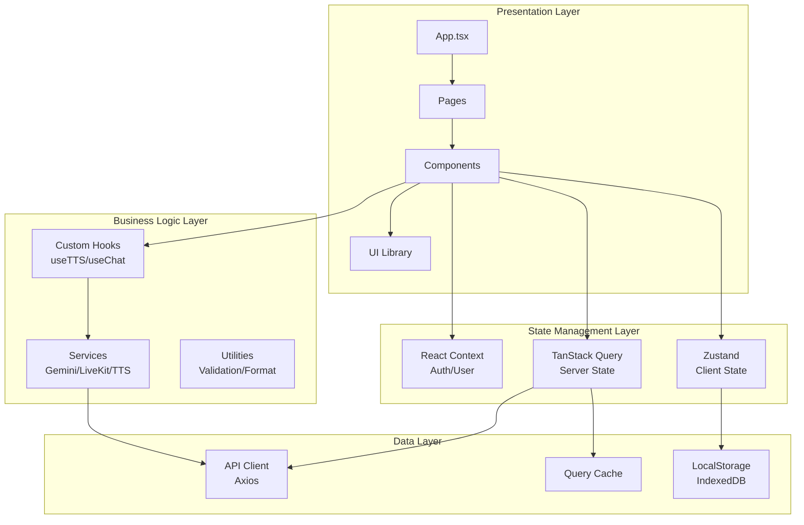
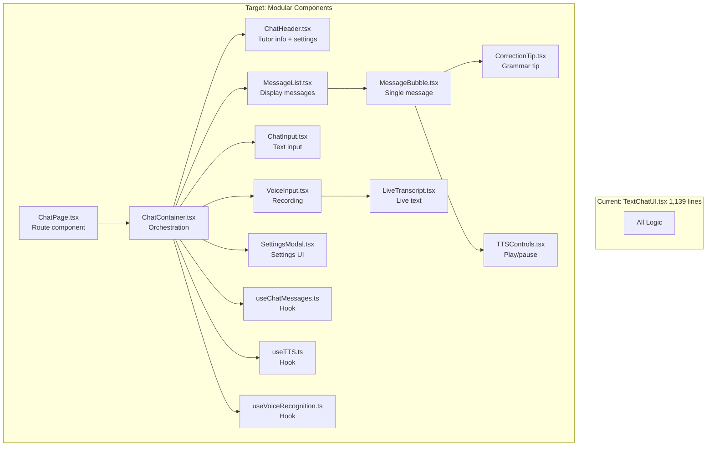
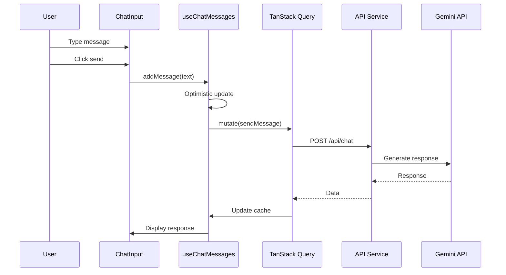
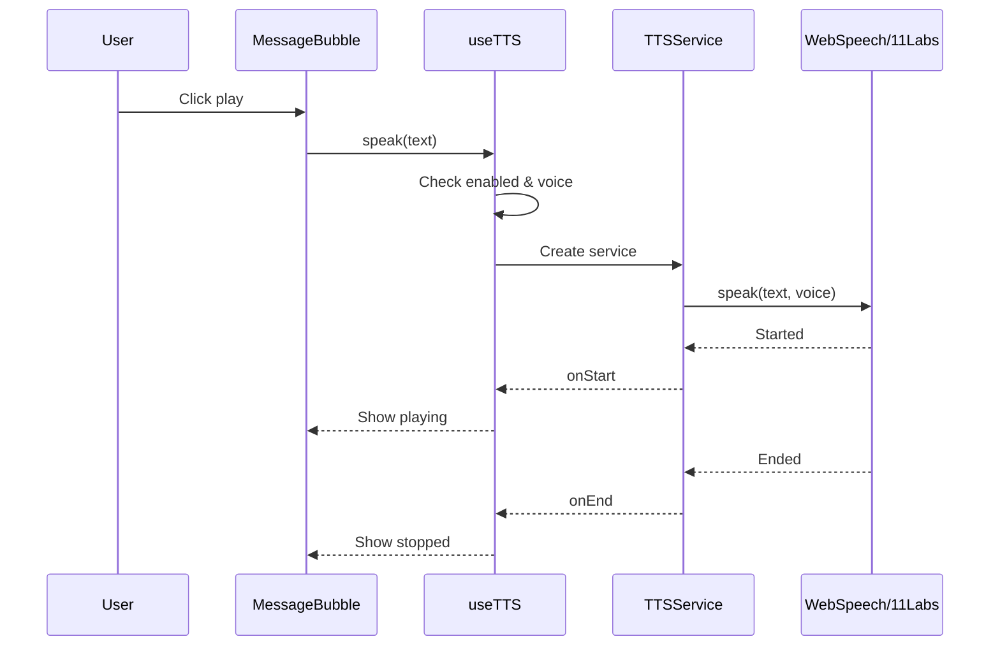

# SAke E-Learning V3 - Architecture & Component Decomposition

## Current Architecture Analysis

### Problem Areas Identified

1. **TextChatUI.tsx (1,139 lines)**
   - Handles chat logic, TTS, voice recording, settings, UI rendering
   - Violates Single Responsibility Principle
   - Difficult to test and maintain
   - Mixed concerns (UI, business logic, state management)

2. **State Management**
   - Mixed patterns: useState, Context, localStorage
   - No centralized state management strategy
   - Duplicated state logic across components

3. **UI Patterns**
   - Duplicated button/input/modal styles
   - No design system
   - Inconsistent spacing, colors, typography

4. **File Structure**
   - util/ and utils/ split (confusing)
   - No feature-based organization
   - Difficult to locate related code

---

## Target Architecture

### System Architecture Diagram



### Component Decomposition: TextChatUI



---

## Detailed Component Architecture

### 1. Chat Feature Module

```
src/features/chat/
├── components/
│   ├── ChatContainer.tsx          # Main orchestration
│   ├── ChatHeader.tsx             # Header with tutor info
│   ├── MessageList.tsx            # Message display
│   ├── MessageBubble.tsx          # Individual message
│   ├── ChatInput.tsx              # Text input field
│   ├── VoiceInput.tsx             # Voice recording
│   ├── LiveTranscript.tsx         # Live transcription
│   ├── CorrectionTip.tsx          # Grammar correction
│   ├── TypingIndicator.tsx        # Loading state
│   └── EmptyState.tsx             # Welcome message
├── hooks/
│   ├── useChatMessages.ts         # Message management
│   ├── useChatHistory.ts          # History tracking
│   └── useCorrections.ts          # Correction parsing
├── services/
│   ├── chatService.ts             # Chat API calls
│   └── correctionService.ts       # Correction logic
├── types.ts                       # Chat types
└── index.ts                       # Exports
```

### 2. TTS Feature Module

```
src/features/tts/
├── components/
│   ├── TTSProvider.tsx            # TTS context provider
│   ├── TTSControls.tsx            # Play/pause/replay
│   ├── VoiceSelector.tsx          # Voice selection dropdown
│   ├── ServiceSelector.tsx        # Service toggle
│   └── TTSToggle.tsx              # On/off switch
├── hooks/
│   ├── useTTS.ts                  # Main TTS hook
│   ├── useVoices.ts               # Voice loading
│   └── useTTSStorage.ts           # Persistence
├── services/
│   ├── ttsFactory.ts              # Service factory
│   ├── webSpeechService.ts        # Web Speech API
│   ├── elevenLabsService.ts       # ElevenLabs
│   └── ttsTypes.ts                # TTS interfaces
└── index.ts
```

### 3. Recording Feature Module

```
src/features/recording/
├── components/
│   ├── VoiceRecorder.tsx          # Recording button
│   ├── RecordingIndicator.tsx     # Visual feedback
│   ├── SilenceDetector.tsx        # Auto-stop on silence
│   └── TranscriptDisplay.tsx      # Show transcript
├── hooks/
│   ├── useVoiceRecognition.ts     # Speech recognition
│   ├── useMediaRecorder.ts        # Audio recording
│   └── useSilenceDetection.ts     # Silence detection
└── types.ts
```

### 4. UI Component Library

```
src/components/ui/
├── button/
│   ├── Button.tsx
│   ├── Button.test.tsx
│   ├── Button.stories.tsx
│   └── index.ts
├── input/
│   ├── Input.tsx
│   ├── TextArea.tsx
│   └── index.ts
├── modal/
│   ├── Modal.tsx
│   ├── ModalHeader.tsx
│   ├── ModalContent.tsx
│   ├── ModalFooter.tsx
│   └── index.ts
├── dropdown/
│   ├── Dropdown.tsx
│   ├──DropdownMenu.tsx
│   └── index.ts
├── select/
│   ├── Select.tsx
│   ├── SelectTrigger.tsx
│   ├── SelectContent.tsx
│   └── index.ts
├── switch/
│   ├── Switch.tsx
│   └── index.ts
├── avatar/
│   ├── Avatar.tsx
│   ├── AvatarGroup.tsx
│   └── index.ts
├── progress/
│   ├── Progress.tsx
│   └── index.ts
└── index.ts                       # Barrel exports
```

---

## Component Composition Patterns

### Pattern 1: Compound Components

**Example: Modal**
```typescript
<Modal open={isOpen} onOpenChange={setIsOpen}>
  <ModalTrigger>Open</ModalTrigger>
  <ModalContent>
    <ModalHeader>
      <ModalTitle>Settings</ModalTitle>
      <ModalDescription>Configure preferences</ModalDescription>
    </ModalHeader>
    <ModalBody>{/* Form */}</ModalBody>
    <ModalFooter>
      <Button>Save</Button>
    </ModalFooter>
  </ModalContent>
</Modal>
```

### Pattern 2: Render Props / Children as Function

**Example: MessageList**
```typescript
<MessageList messages={messages}>
  {(message) => (
    <MessageBubble
      key={message.id}
      message={message}
      variant={message.sender === 'user' ? 'sent' : 'received'}
    />
  )}
</MessageList>
```

### Pattern 3: Custom Hooks for Logic

**Example: Chat Hook**
```typescript
function ChatContainer() {
  const {
    messages,
    addMessage,
    isLoading,
    error,
  } = useChatMessages(scenario)

  const {
    isRecording,
    transcript,
    startRecording,
    stopRecording,
  } = useVoiceRecognition()

  const {
    isSpeaking,
    speak,
    stop,
    selectedVoice,
  } = useTTS()

  return (
    <div>
      <MessageList messages={messages} />
      <ChatInput onSend={addMessage} />
      <VoiceInput onRecord={startRecording} />
    </div>
  )
}
```

---

## State Management Strategy

### Server State (TanStack Query)

```typescript
// src/features/api/queries.ts
export const chatQueries = {
  all: ['chat'] as const,
  lists: () => [...chatQueries.all, 'list'] as const,
  list: (scenario: string) => [...chatQueries.lists(), scenario] as const,
  details: () => [...chatQueries.all, 'detail'] as const,
  detail: (id: string) => [...chatQueries.details(), id] as const,
}

// Usage
function ChatMessages({ scenario }: { scenario: string }) {
  const { data, isLoading } = useQuery({
    queryKey: chatQueries.list(scenario),
    queryFn: () => fetchChatMessages(scenario),
  })
  // ...
}
```

### Client State (Zustand)

```typescript
// src/stores/useChatStore.ts
interface ChatState {
  // State
  messages: Message[]
  input: string
  isLoading: boolean

  // Actions
  setInput: (input: string) => void
  addMessage: (message: Message) => void
  sendMessage: () => Promise<void>
}

export const useChatStore = create<ChatState>((set, get) => ({
  messages: [],
  input: '',
  isLoading: false,

  setInput: (input) => set({ input }),

  addMessage: (message) =>
    set((state) => ({ messages: [...state.messages, message] })),

  sendMessage: async () => {
    const { input, messages } = get()
    set({ isLoading: true })

    try {
      const response = await api.sendMessage(input)
      set({
        messages: [...messages, { text: input, sender: 'user' }, response],
        input: '',
      })
    } finally {
      set({ isLoading: false })
    }
  },
}))
```

### Shared State (Context)

```typescript
// src/contexts/TTSContext.tsx
interface TTSContextValue {
  enabled: boolean
  voice: TTSVoice | null
  speak: (text: string) => void
  stop: () => void
}

export const TTSContext = createContext<TTSContextValue | null>(null)

export function TTSProvider({ children }: { children: React.ReactNode }) {
  const [enabled, setEnabled] = useState(true)
  const [voice, setVoice] = useState<TTSVoice | null>(null)

  const speak = useCallback((text: string) => {
    if (!enabled || !voice) return
    // Speak logic
  }, [enabled, voice])

  const stop = useCallback(() => {
    // Stop logic
  }, [])

  return (
    <TTSContext.Provider value={{ enabled, voice, speak, stop }}>
      {children}
    </TTSContext.Provider>
  )
}

export function useTTS() {
  const context = useContext(TTSContext)
  if (!context) throw new Error('useTTS must be used within TTSProvider')
  return context
}
```

---

## Data Flow Diagrams

### Chat Message Flow



### TTS Flow



---

## File Structure Comparison

### Before (Current)
```
sakae-e-learning-v3/
├── components/
│   ├── TextChatUI.tsx              # 1,139 lines ❌
│   ├── VoiceChatUI.tsx             # 519 lines ❌
│   ├── AudioOnlyChat.tsx           # 269 lines ⚠️
│   ├── GeminiVoiceChat.tsx         # 343 lines ⚠️
│   └── ...
├── util/                           # Confusing ❌
│   └── audioUtils.ts
├── utils/                          # Confusing ❌
│   └── correctionParser.ts
├── hooks/
│   ├── useLiveKitRoom.ts           # 17,975 bytes ❌
│   ├── useGeminiLive.ts            # 15,059 bytes ❌
│   └── useLocalStorage.ts          # ✅
├── services/
│   ├── api.ts
│   ├── authService.ts
│   ├── geminiService.ts
│   └── tts/                        # ✅
└── types.ts
```

### After (Target)
```
sakae-e-learning-v3/
├── src/
│   ├── app/
│   │   ├── providers.tsx           # Provider composition
│   │   └── routes.tsx              # Route config
│   ├── features/                   # Feature modules
│   │   ├── chat/
│   │   │   ├── components/
│   │   │   │   ├── ChatContainer.tsx       # ~100 lines ✅
│   │   │   │   ├── MessageList.tsx         # ~80 lines ✅
│   │   │   │   ├── MessageBubble.tsx       # ~60 lines ✅
│   │   │   │   ├── ChatInput.tsx           # ~50 lines ✅
│   │   │   │   └── CorrectionTip.tsx       # ~40 lines ✅
│   │   │   ├── hooks/
│   │   │   │   ├── useChatMessages.ts      # ~80 lines ✅
│   │   │   │   └── useChatHistory.ts       # ~60 lines ✅
│   │   │   ├── services/
│   │   │   │   ├── chatService.ts
│   │   │   │   └── correctionService.ts
│   │   │   └── types.ts
│   │   ├── tts/
│   │   │   ├── components/
│   │   │   │   ├── TTSProvider.tsx         # ~50 lines ✅
│   │   │   │   ├── TTSControls.tsx         # ~40 lines ✅
│   │   │   │   └── VoiceSelector.tsx       # ~60 lines ✅
│   │   │   ├── hooks/
│   │   │   │   ├── useTTS.ts               # ~100 lines ✅
│   │   │   │   └── useVoices.ts            # ~80 lines ✅
│   │   │   └── services/
│   │   ├── recording/
│   │   │   ├── components/
│   │   │   │   ├── VoiceRecorder.tsx       # ~80 lines ✅
│   │   │   │   └── LiveTranscript.tsx      # ~40 lines ✅
│   │   │   └── hooks/
│   │   │       └── useVoiceRecognition.ts  # ~120 lines ✅
│   │   └── livekit/
│   ├── components/
│   │   ├── ui/                    # Base UI library
│   │   │   ├── button/
│   │   │   ├── input/
│   │   │   ├── modal/
│   │   │   └── ...
│   │   ├── chat/                  # Chat-specific shared
│   │   └── layout/                # Layout components
│   ├── composables/               # Renamed from hooks/
│   │   ├── useLocalStorage.ts
│   │   ├── useMediaQuery.ts
│   │   └── useDebounce.ts
│   ├── stores/                    # Zustand stores
│   │   ├── useChatStore.ts
│   │   ├── useUIStore.ts
│   │   └── useTTSStore.ts
│   ├── lib/                       # Consolidated utils/
│   │   ├── cn.ts
│   │   ├── format.ts
│   │   └── validation.ts
│   ├── contexts/                  # React contexts
│   │   ├── AuthContext.tsx
│   │   └── UserContext.tsx
│   ├── services/                  # API services
│   │   ├── api/
│   │   ├── gemini/
│   │   └── livekit/
│   ├── pages/                     # Route components
│   │   └── chat/
│   ├── styles/                    # Global styles
│   │   ├── tokens.css
│   │   └── base.css
│   └── types/                     # Global types
```

---

## Component Size Guidelines

### Target Sizes

| Component Type | Target Lines | Max Lines |
|----------------|--------------|-----------|
| UI Components | 50-100 | 150 |
| Feature Components | 100-200 | 300 |
| Page Components | 150-250 | 400 |
| Hooks | 50-150 | 200 |
| Services | 100-200 | 300 |

### Current vs Target

| Component | Current | Target | Status |
|-----------|---------|--------|--------|
| TextChatUI.tsx | 1,139 | ~150 (split into 8) | ❌ Needs split |
| VoiceChatUI.tsx | 519 | ~150 (split into 4) | ❌ Needs split |
| useLiveKitRoom.ts | ~500 lines | ~150 (split into 3) | ❌ Needs split |
| useGeminiLive.ts | ~400 lines | ~150 (split into 2) | ❌ Needs split |
| AudioOnlyChat.tsx | 269 | ~150 | ⚠️ Needs refactor |
| GeminiVoiceChat.tsx | 343 | ~150 | ⚠️ Needs refactor |

---

## Migration Strategy

### Phase 1: Create Feature Modules (Week 1)
1. Create `src/features/chat/` directory structure
2. Create `src/features/tts/` directory structure
3. Create `src/features/recording/` directory structure

### Phase 2: Extract Components (Week 2-3)
1. Extract UI components to `src/components/ui/`
2. Extract chat components to `src/features/chat/components/`
3. Extract TTS components to `src/features/tts/components/`

### Phase 3: Extract Hooks (Week 3-4)
1. Create feature-specific hooks
2. Consolidate duplicated logic
3. Add proper TypeScript types

### Phase 4: Migrate State (Week 4-5)
1. Add TanStack Query
2. Add Zustand stores
3. Migrate from Context where appropriate

### Phase 5: Update Imports (Week 5)
1. Update all imports
2. Remove old files
3. Update path aliases

---

## Testing Strategy

### Unit Tests
```typescript
// src/features/chat/components/MessageBubble.test.tsx
describe('MessageBubble', () => {
  it('renders user message correctly', () => {
    // Test user message styling
  })

  it('renders AI message with TTS button', () => {
    // Test AI message features
  })

  it('displays corrections when present', () => {
    // Test correction display
  })
})
```

### Integration Tests
```typescript
// src/features/chat/ChatContainer.test.tsx
describe('Chat Flow', () => {
  it('sends message and receives response', () => {
    // Test full chat flow
  })

  it('handles voice input', () => {
    // Test voice recording flow
  })
})
```

### E2E Tests
```typescript
// e2e/chat.spec.ts
test('complete chat workflow', async ({ page }) => {
  await page.goto('/chat/text')
  await page.fill('input', 'Hello')
  await page.click('button[aria-label="Send"]')
  await expect(page.locator('text=Response')).toBeVisible()
})
```

---

**Document Version:** 1.0
**Last Updated:** 2025-01-29
**Author:** SAke E-Learning Team
