# Architecture Diagrams - React + Vite Refactoring

Visual diagrams representing the current and target architecture for the SAke E-Learning V3 refactoring.

---

## 📊 Table of Contents

1. [Current Architecture](#current-architecture)
2. [Target Architecture](#target-architecture)
3. [Component Decomposition](#component-decomposition)
4. [State Management Flow](#state-management-flow)
5. [Data Flow Patterns](#data-flow-patterns)
6. [Feature Module Structure](#feature-module-structure)
7. [Testing Strategy](#testing-strategy)

---

## 🏗️ Current Architecture

### High-Level Overview

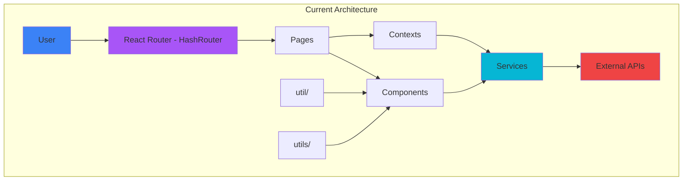

### Current Component Structure

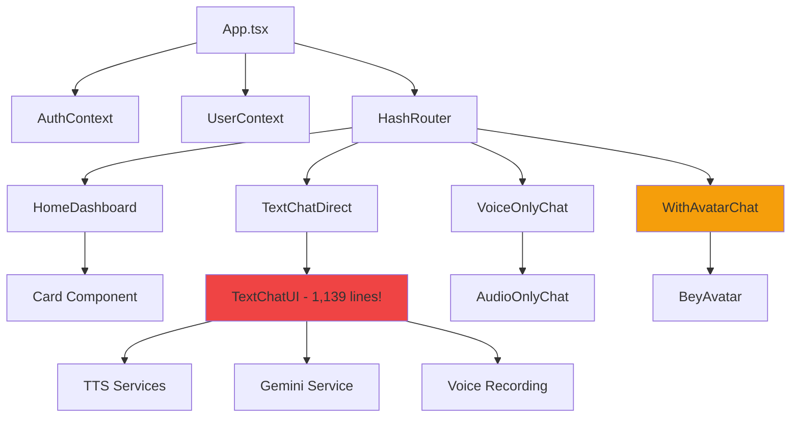

### Current State Management

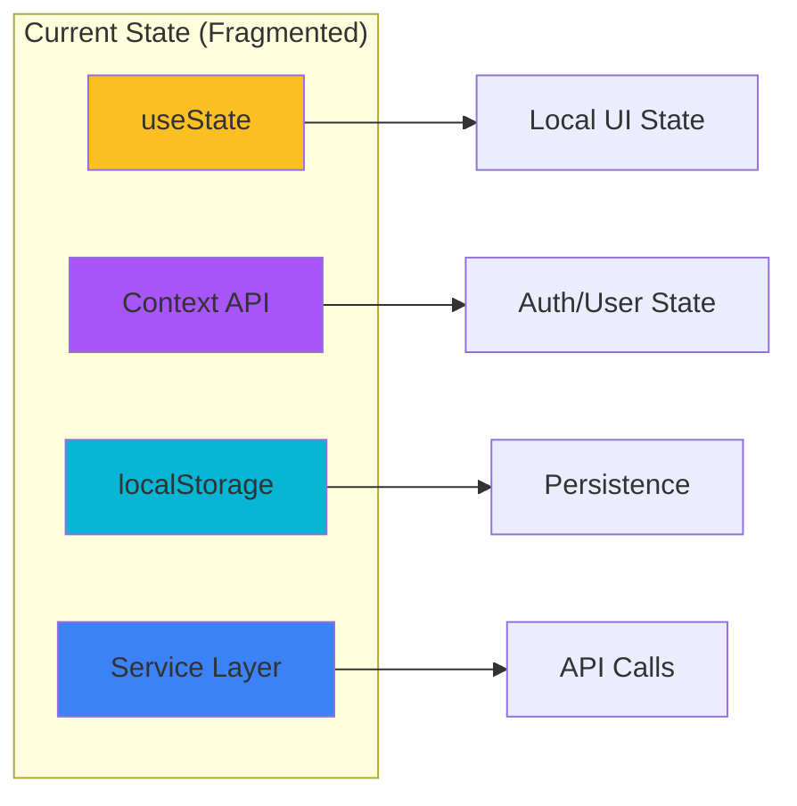

---

## 🎯 Target Architecture

### Future High-Level Overview

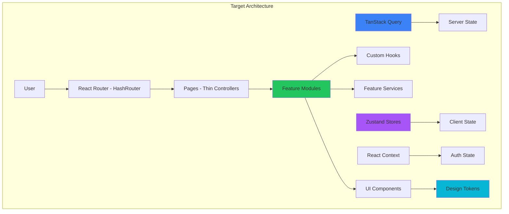

### Target Component Structure

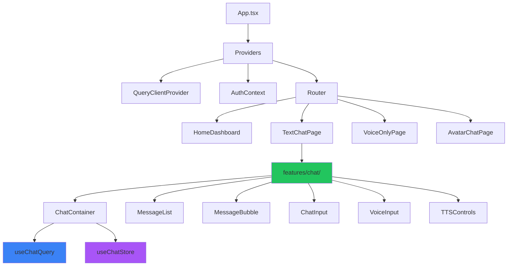

---

## 🔧 Component Decomposition

### TextChatUI Decomposition

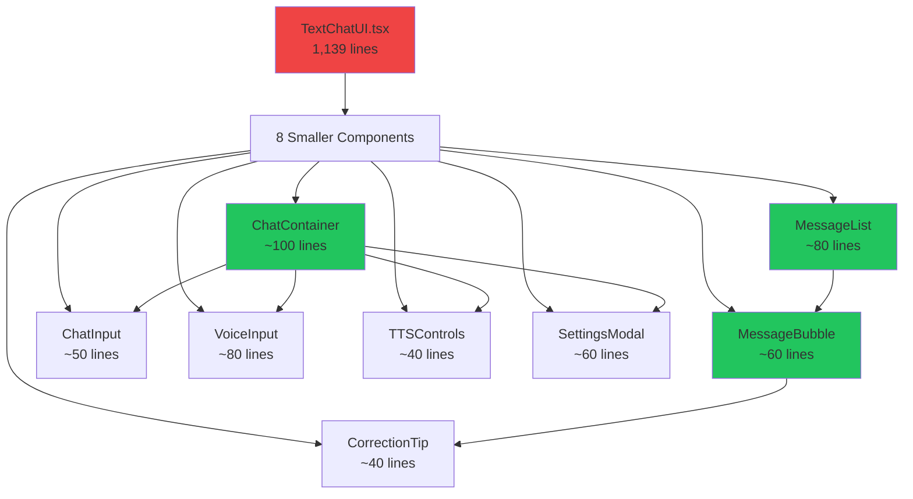

### Before/After File Structure

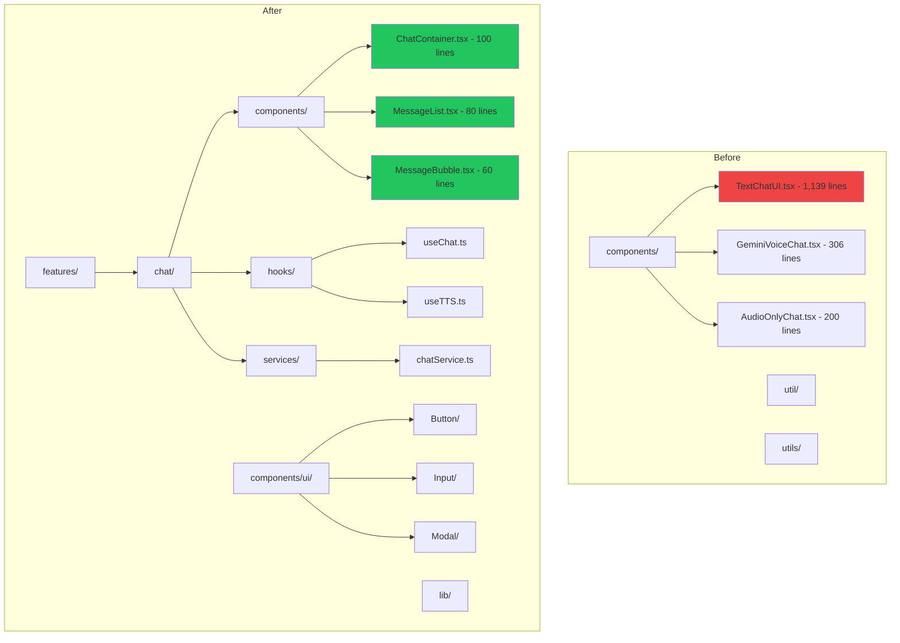

---

## 🔄 State Management Flow

### New State Management Architecture

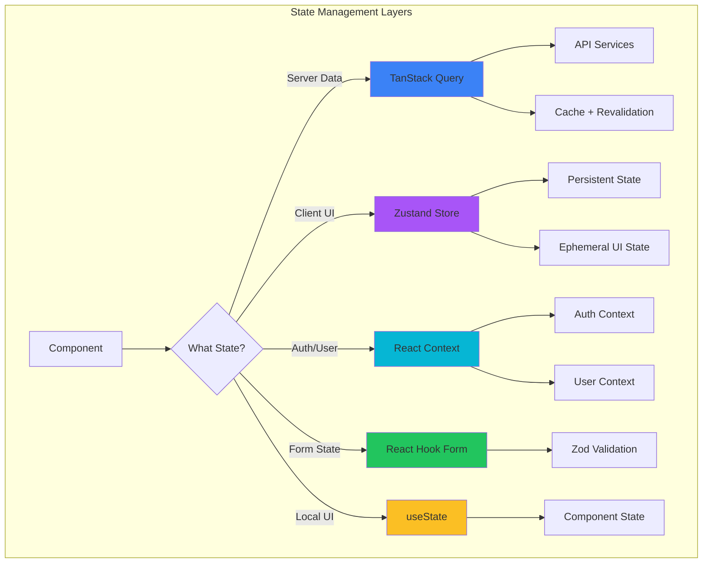

### Data Fetching Flow

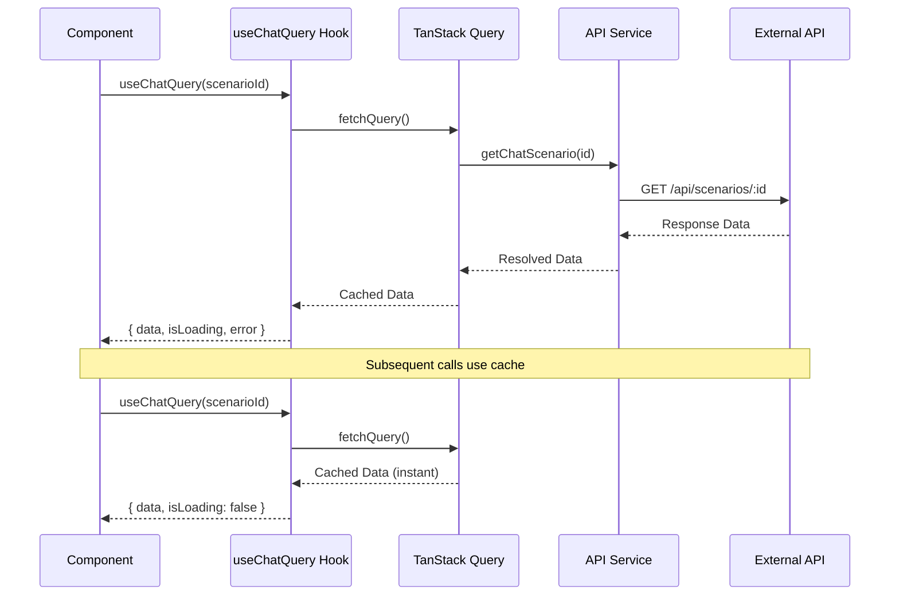

---

## 📊 Data Flow Patterns

### Chat Feature Data Flow

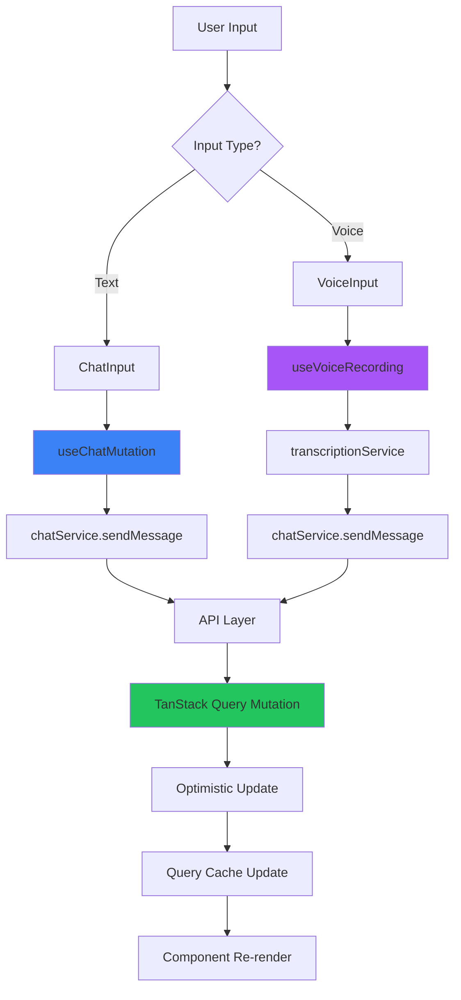

### Authentication Flow

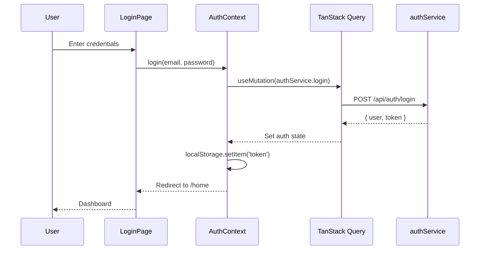

---

## 🧩 Feature Module Structure

### Chat Feature Module

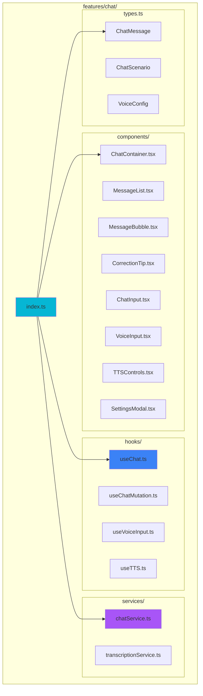

### TTS Feature Module

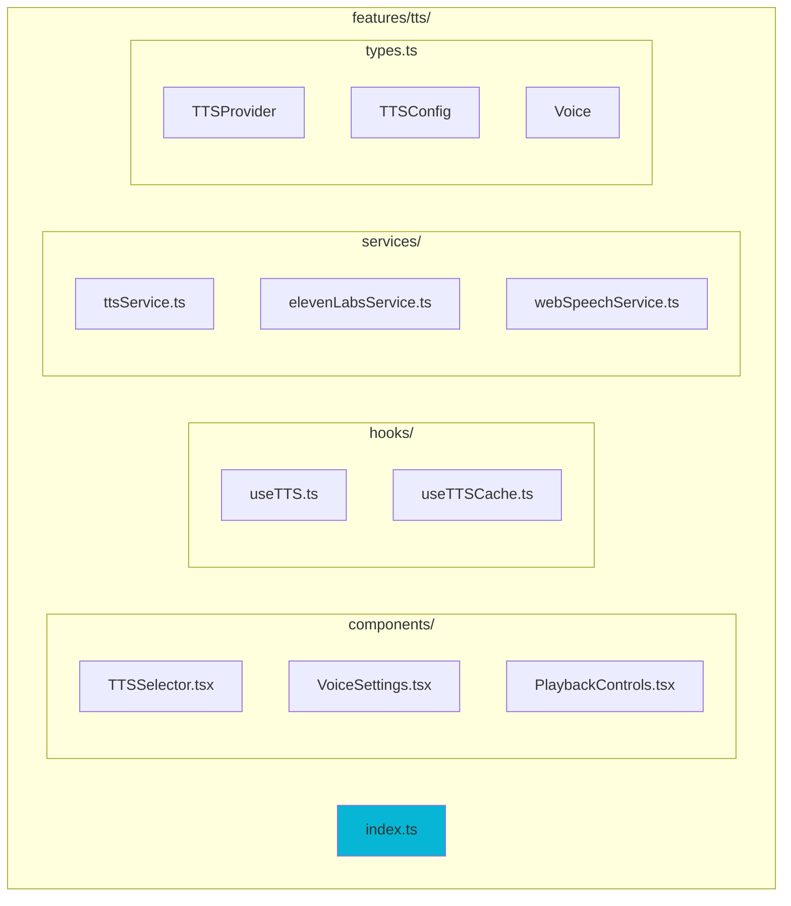

---

## 🧪 Testing Strategy

### Test Pyramid

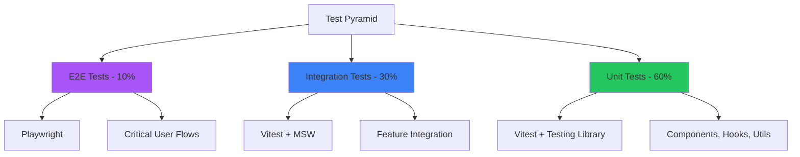

### Unit Test Coverage

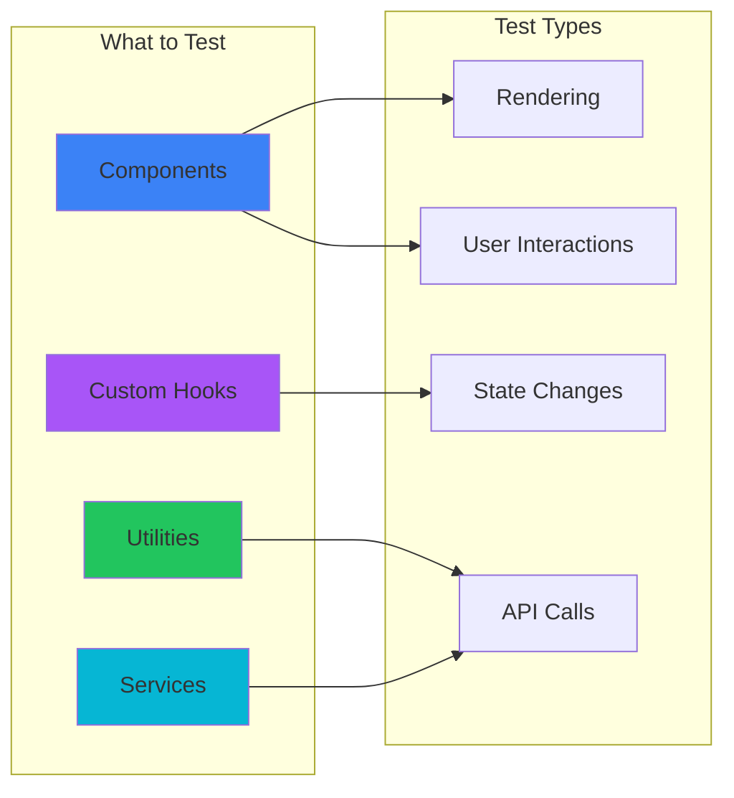

---

## 🎯 Component Composition Patterns

### Container vs Presentational Components

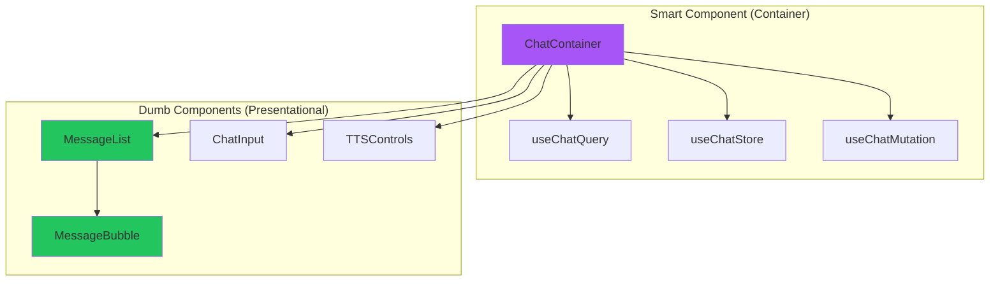

---

## 📦 File Organization

### Target Directory Structure

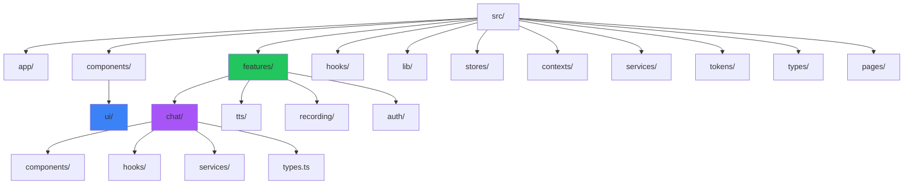

---

## 🚀 Performance Optimization

### Code Splitting Strategy

```mermaid
graph TD
    A[App.tsx] --> B[React.lazy()]

    B --> C[HomeDashboard]
    B --> D[ChatPages]
    B --> E[AvatarPages]

    D --> F[Suspense Fallback]
    E --> F

    C --> G[Route-based Chunk]
    D --> H[Route-based Chunk]
    E --> I[Route-based Chunk]

    style B fill:#3b82f6
    style F fill:#fbbf24
```

### Bundle Size Reduction

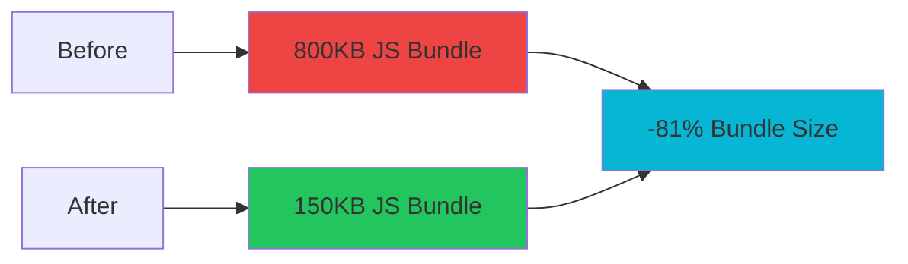

---

## 📊 Migration Progress

### Refactoring Phases

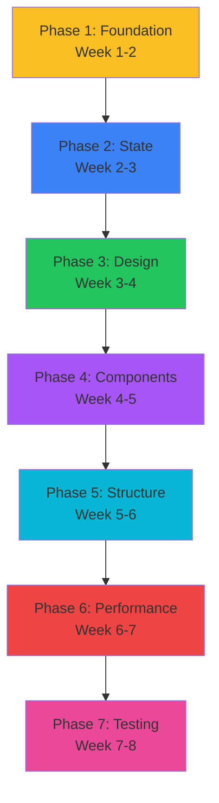

---

## 🎯 Success Metrics

### Target vs Current

```mermaid
graph LR
    subgraph "Current State"
        A1[Component Size]
        A1 --> B1[Up to 1,139 lines]

        C1[Test Coverage]
        C1 --> D1[0%]

        E1[Bundle Size]
        E1 --> F1[800KB]
    end

    subgraph "Target State"
        A2[Component Size]
        A2 --> B2[< 300 lines]

        C2[Test Coverage]
        C2 --> D2[80%+]

        E2[Bundle Size]
        E2 --> F2[640KB -20%]
    end

    style B1 fill:#ef4444
    style D1 fill:#ef4444
    style F1 fill:#fbbf24

    style B2 fill:#22c55e
    style D2 fill:#22c55e
    style F2 fill:#22c55e
```

---

## 🔗 Integration Points

### External Services

```mermaid
graph TD
    A[SAke E-Learning App] --> B[LiveKit]
    A --> C[Gemini Live API]
    A --> D[ElevenLabs TTS]
    A --> E[Backend API]

    B --> F[Real-time Audio]
    C --> G[AI Chat]
    D --> H[Voice Synthesis]
    E --> I[Auth, Scenarios, Progress]

    style A fill:#3b82f6
    style B fill:#a855f7
    style C fill:#06b6d4
    style D fill:#22c55e
    style E fill:#ef4444
```

---

**Document Version:** 1.0
**Last Updated:** 2025-01-29
**Authors:** SAke E-Learning Team

All diagrams created with Mermaid syntax. View in compatible markdown renderers like GitHub, GitLab, or with Mermaid live editor.
