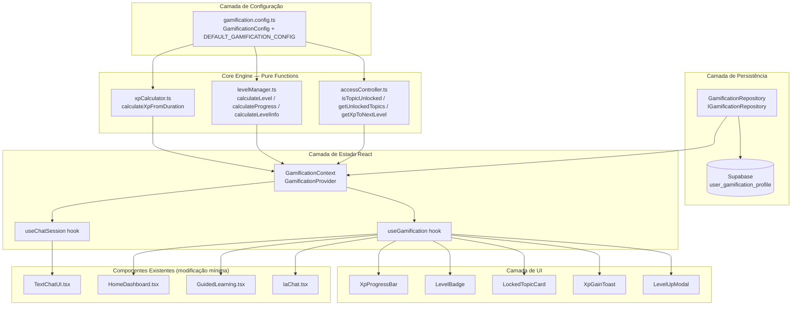
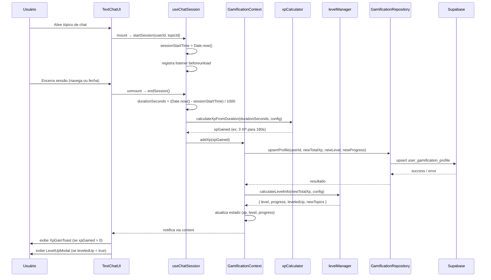

# Documento de Design Técnico — Sistema de Gamificação

## Visão Geral

O Sistema de Gamificação do Sakae E-Learning v3 adiciona uma camada de engajamento baseada em tempo de uso: o usuário acumula XP (Pontos de Experiência) a cada minuto de prática nos chats, sobe de nível (1 a 5) e desbloqueia progressivamente os 10 tópicos/cenários disponíveis. O sistema é construído como um módulo independente e configurável que se integra ao frontend React existente sem modificar a lógica de negócio dos componentes de chat.

### Decisão Arquitetural: Onde Persistir o Perfil de Gamificação

O projeto possui dois bancos de dados:
- **SQL Server** (via .NET 8 WebAPI): autenticação, tabela `Users`, `User.Id` é `int`
- **Supabase** (PostgreSQL): dados de aprendizado (`conversations`, `messages`, `user_learning_profile`, `conversation_context`), `user_id` é `TEXT`

**Decisão: Supabase**

Justificativas:
1. **Coesão de dados**: o perfil de gamificação é dado de aprendizado — pertence ao mesmo domínio que `user_learning_profile` e `conversations`. Manter tudo no Supabase evita joins cross-database.
2. **Sem novo endpoint .NET**: adicionar uma tabela no Supabase não requer nenhuma alteração no backend .NET, reduzindo escopo e risco.
3. **Padrão existente**: o frontend já usa o cliente Supabase JS para todos os dados de aprendizado. O `GamificationRepository` seguirá o mesmo padrão de `profileService` e `conversationService`.
4. **`user_id` como TEXT**: o `user_id` no Supabase já é TEXT (email ou identificador do JWT). O perfil de gamificação usará o mesmo identificador, mantendo consistência com as demais tabelas.
5. **Custo zero de infraestrutura**: nenhuma migração de SQL Server, nenhum novo controller .NET, nenhuma nova rota de API.

**Trade-off aceito**: o SQL Server continua sendo a fonte de verdade para autenticação. O `user_id` no Supabase é derivado do token JWT (email do usuário), o que já é o padrão atual do projeto.


---

## Arquitetura

### Diagrama de Camadas



### Diagrama de Fluxo — Sessão de Chat e Acúmulo de XP



### Estrutura de Arquivos

```
sakae-e-learning-v3/
├── gamification/                          ← novo módulo raiz
│   ├── gamification.config.ts             ← ÚNICO arquivo de configuração
│   ├── core/
│   │   ├── xpCalculator.ts                ← pure function: duração → XP
│   │   ├── levelManager.ts                ← pure functions: XP → nível/progresso
│   │   └── accessController.ts            ← pure function: nível → tópicos desbloqueados
│   ├── repository/
│   │   ├── IGamificationRepository.ts     ← interface (para mock em testes)
│   │   └── GamificationRepository.ts      ← implementação Supabase
│   ├── context/
│   │   └── GamificationContext.tsx        ← Provider + estado global
│   ├── hooks/
│   │   ├── useGamification.ts             ← API pública para componentes
│   │   └── useChatSession.ts              ← rastreamento de tempo de sessão
│   └── components/
│       ├── XpProgressBar.tsx
│       ├── LevelBadge.tsx
│       ├── LockedTopicCard.tsx
│       ├── XpGainToast.tsx
│       └── LevelUpModal.tsx
├── context/
│   ├── AuthContext.tsx                    ← existente, sem alteração
│   └── UserContext.tsx                    ← existente, sem alteração
├── components/
│   └── TextChatUI.tsx                     ← modificação mínima: integra useChatSession
├── pages/
│   ├── HomeDashboard.tsx                  ← modificação mínima: exibe XpProgressBar + LevelBadge
│   ├── GuidedLearning.tsx                 ← modificação mínima: usa LockedTopicCard
│   └── IaChat.tsx                         ← modificação mínima: usa LockedTopicCard
└── App.tsx                                ← adiciona GamificationProvider
```


---

## Componentes e Interfaces

### 1. Módulo de Configuração — `gamification.config.ts`

Arquivo central que define todas as regras de negócio. Nenhum outro módulo importa constantes de gamificação diretamente — todos recebem a config como parâmetro.

```typescript
// gamification/gamification.config.ts

export interface LevelThreshold {
  level: number;
  label: string;
  minXp: number;
}

export interface TopicAccessRule {
  topicId: string;
  minLevel: number;
}

export interface GamificationConfig {
  /** XP ganho por minuto completo de sessão (padrão: 1) */
  xpPerMinute: number;
  /** Duração mínima em segundos para ganhar XP (padrão: 60) */
  minSessionSeconds: number;
  /** Limiares de XP por nível, ordenados do menor para o maior */
  levelThresholds: LevelThreshold[];
  /** Mapeamento de tópico para nível mínimo de desbloqueio */
  topicAccessRules: TopicAccessRule[];
}

export const DEFAULT_GAMIFICATION_CONFIG: GamificationConfig = {
  xpPerMinute: 1,
  minSessionSeconds: 60,
  levelThresholds: [
    { level: 1, label: 'Iniciante',     minXp: 0   },
    { level: 2, label: 'Básico',        minXp: 30  },
    { level: 3, label: 'Intermediário', minXp: 100 },
    { level: 4, label: 'Avançado',      minXp: 250 },
    { level: 5, label: 'Fluente',       minXp: 500 },
  ],
  topicAccessRules: [
    { topicId: 'phone-screen',          minLevel: 1 },
    { topicId: 'grammar-essentials',    minLevel: 1 },
    { topicId: 'job-interviews',        minLevel: 2 },
    { topicId: 'vocabulary-builder',    minLevel: 2 },
    { topicId: 'travel-conversations',  minLevel: 3 },
    { topicId: 'pronunciation-practice',minLevel: 3 },
    { topicId: 'business-meetings',     minLevel: 4 },
    { topicId: 'business-english',      minLevel: 4 },
    { topicId: 'travel-phrases',        minLevel: 5 },
    { topicId: 'idioms-slang',          minLevel: 5 },
  ],
};

/**
 * Valida uma GamificationConfig e lança erro descritivo se inválida.
 * Chamada pelos módulos core antes de executar qualquer cálculo.
 */
export function validateConfig(config: GamificationConfig): void {
  if (!config) throw new Error('[GamificationConfig] Config é obrigatória');
  if (typeof config.xpPerMinute !== 'number' || config.xpPerMinute <= 0)
    throw new Error('[GamificationConfig] xpPerMinute deve ser um número positivo');
  if (typeof config.minSessionSeconds !== 'number' || config.minSessionSeconds < 0)
    throw new Error('[GamificationConfig] minSessionSeconds deve ser não-negativo');
  if (!Array.isArray(config.levelThresholds) || config.levelThresholds.length === 0)
    throw new Error('[GamificationConfig] levelThresholds deve ser um array não-vazio');
  if (!Array.isArray(config.topicAccessRules) || config.topicAccessRules.length === 0)
    throw new Error('[GamificationConfig] topicAccessRules deve ser um array não-vazio');
}
```

### 2. Core Engine — Pure Functions

#### `xpCalculator.ts`

```typescript
// gamification/core/xpCalculator.ts

import { GamificationConfig, validateConfig } from '../gamification.config';

/**
 * Converte duração de sessão em XP.
 * Pure function: sem side effects, sem estado externo.
 *
 * @param durationSeconds - Duração da sessão em segundos (>= 0)
 * @param config - Configuração de gamificação
 * @returns XP ganho (inteiro não-negativo)
 */
export function calculateXpFromDuration(
  durationSeconds: number,
  config: GamificationConfig
): number {
  validateConfig(config);
  if (durationSeconds < config.minSessionSeconds) return 0;
  return Math.floor((durationSeconds / 60) * config.xpPerMinute);
}

/**
 * Acumula XP de sessão ao total existente.
 * Garante que o resultado nunca seja negativo.
 */
export function accumulateXp(currentTotalXp: number, sessionXp: number): number {
  return Math.max(0, currentTotalXp + Math.max(0, sessionXp));
}
```

#### `levelManager.ts`

```typescript
// gamification/core/levelManager.ts

import { GamificationConfig, LevelThreshold, validateConfig } from '../gamification.config';

export interface LevelInfo {
  level: number;
  label: string;
  progress: number;       // 0–100 (inteiro)
  currentLevelXp: number; // XP acumulado dentro do nível atual
  xpToNextLevel: number;  // XP faltante para o próximo nível (0 se nível máximo)
  isMaxLevel: boolean;
}

/**
 * Calcula o nível atual com base no XP total.
 * Pure function.
 */
export function calculateLevel(totalXp: number, config: GamificationConfig): number {
  validateConfig(config);
  const thresholds = [...config.levelThresholds].sort((a, b) => b.minXp - a.minXp);
  const threshold = thresholds.find(t => totalXp >= t.minXp);
  return threshold?.level ?? 1;
}

/**
 * Calcula o progresso percentual dentro do nível atual (0–100).
 * Pure function.
 */
export function calculateProgress(totalXp: number, config: GamificationConfig): number {
  validateConfig(config);
  const thresholds = config.levelThresholds.sort((a, b) => a.minXp - b.minXp);
  const maxLevel = thresholds[thresholds.length - 1].level;
  const currentLevel = calculateLevel(totalXp, config);

  if (currentLevel >= maxLevel) return 100;

  const currentThreshold = thresholds.find(t => t.level === currentLevel)!;
  const nextThreshold = thresholds.find(t => t.level === currentLevel + 1)!;
  const range = nextThreshold.minXp - currentThreshold.minXp;
  const earned = totalXp - currentThreshold.minXp;

  return Math.min(100, Math.max(0, Math.round((earned / range) * 100)));
}

/**
 * Retorna informações completas de nível para um dado XP total.
 * Pure function — combina calculateLevel e calculateProgress.
 */
export function calculateLevelInfo(totalXp: number, config: GamificationConfig): LevelInfo {
  validateConfig(config);
  const thresholds = [...config.levelThresholds].sort((a, b) => a.minXp - b.minXp);
  const maxLevel = thresholds[thresholds.length - 1].level;
  const level = calculateLevel(totalXp, config);
  const progress = calculateProgress(totalXp, config);
  const isMaxLevel = level >= maxLevel;

  const currentThreshold = thresholds.find(t => t.level === level)!;
  const nextThreshold = thresholds.find(t => t.level === level + 1);

  return {
    level,
    label: currentThreshold.label,
    progress,
    currentLevelXp: totalXp - currentThreshold.minXp,
    xpToNextLevel: isMaxLevel ? 0 : (nextThreshold!.minXp - totalXp),
    isMaxLevel,
  };
}
```

#### `accessController.ts`

```typescript
// gamification/core/accessController.ts

import { GamificationConfig, validateConfig } from '../gamification.config';

export interface TopicAccessResult {
  topicId: string;
  isUnlocked: boolean;
  requiredLevel: number;
  xpRequired: number; // XP mínimo para desbloquear (baseado no nível mínimo)
}

/**
 * Verifica se um tópico está desbloqueado para um dado nível de usuário.
 * Pure function — determinística e sem side effects.
 */
export function isTopicUnlocked(
  userLevel: number,
  topicId: string,
  config: GamificationConfig
): boolean {
  validateConfig(config);
  const rule = config.topicAccessRules.find(r => r.topicId === topicId);
  if (!rule) return false; // tópico desconhecido = bloqueado por segurança
  return userLevel >= rule.minLevel;
}

/**
 * Retorna todos os tópicos desbloqueados para um dado nível.
 * Pure function.
 */
export function getUnlockedTopics(
  userLevel: number,
  config: GamificationConfig
): string[] {
  validateConfig(config);
  return config.topicAccessRules
    .filter(r => userLevel >= r.minLevel)
    .map(r => r.topicId);
}

/**
 * Retorna informações de acesso para todos os tópicos.
 * Pure function.
 */
export function getAllTopicAccess(
  userLevel: number,
  totalXp: number,
  config: GamificationConfig
): TopicAccessResult[] {
  validateConfig(config);
  return config.topicAccessRules.map(rule => {
    const levelThreshold = config.levelThresholds.find(t => t.level === rule.minLevel);
    return {
      topicId: rule.topicId,
      isUnlocked: userLevel >= rule.minLevel,
      requiredLevel: rule.minLevel,
      xpRequired: Math.max(0, (levelThreshold?.minXp ?? 0) - totalXp),
    };
  });
}
```

### 3. Camada de Persistência

#### `IGamificationRepository.ts`

```typescript
// gamification/repository/IGamificationRepository.ts

export interface GamificationProfile {
  user_id: string;
  total_xp: number;
  current_level: number;
  level_progress: number;
  created_at?: string;
  updated_at?: string;
}

export interface IGamificationRepository {
  /**
   * Busca o perfil de gamificação do usuário.
   * Retorna null se não existir.
   */
  getProfile(userId: string): Promise<GamificationProfile | null>;

  /**
   * Cria ou atualiza o perfil de gamificação (upsert).
   * Garante unicidade por user_id.
   */
  upsertProfile(profile: Omit<GamificationProfile, 'created_at' | 'updated_at'>): Promise<GamificationProfile | null>;

  /**
   * Inicializa o perfil com valores padrão se não existir.
   * Retorna o perfil existente ou o recém-criado.
   */
  getOrCreateProfile(userId: string): Promise<GamificationProfile>;
}
```

#### `GamificationRepository.ts`

```typescript
// gamification/repository/GamificationRepository.ts

import { supabase } from '../../services/supabase';
import { IGamificationRepository, GamificationProfile } from './IGamificationRepository';

export class GamificationRepository implements IGamificationRepository {
  private readonly TABLE = 'user_gamification_profile';

  async getProfile(userId: string): Promise<GamificationProfile | null> {
    const { data, error } = await supabase
      .from(this.TABLE)
      .select('*')
      .eq('user_id', userId)
      .single();

    if (error && error.code !== 'PGRST116') {
      console.error('[GamificationRepository] getProfile error:', error);
      return null;
    }
    return data ?? null;
  }

  async upsertProfile(
    profile: Omit<GamificationProfile, 'created_at' | 'updated_at'>
  ): Promise<GamificationProfile | null> {
    const { data, error } = await supabase
      .from(this.TABLE)
      .upsert(
        { ...profile, updated_at: new Date().toISOString() },
        { onConflict: 'user_id' }
      )
      .select()
      .single();

    if (error) {
      console.error('[GamificationRepository] upsertProfile error:', error);
      return null;
    }
    return data;
  }

  async getOrCreateProfile(userId: string): Promise<GamificationProfile> {
    const existing = await this.getProfile(userId);
    if (existing) return existing;

    const created = await this.upsertProfile({
      user_id: userId,
      total_xp: 0,
      current_level: 1,
      level_progress: 0,
    });

    // Fallback seguro: se a persistência falhar, retorna perfil padrão em memória
    return created ?? {
      user_id: userId,
      total_xp: 0,
      current_level: 1,
      level_progress: 0,
    };
  }
}

export const gamificationRepository = new GamificationRepository();
```

### 4. React Context — `GamificationContext.tsx`

```typescript
// gamification/context/GamificationContext.tsx

import React, { createContext, useContext, useState, useEffect, useCallback, ReactNode } from 'react';
import { GamificationProfile, IGamificationRepository } from '../repository/IGamificationRepository';
import { gamificationRepository } from '../repository/GamificationRepository';
import { GamificationConfig, DEFAULT_GAMIFICATION_CONFIG } from '../gamification.config';
import { calculateLevelInfo, LevelInfo } from '../core/levelManager';
import { accumulateXp } from '../core/xpCalculator';
import { getAllTopicAccess, TopicAccessResult } from '../core/accessController';

export interface GamificationState {
  profile: GamificationProfile | null;
  levelInfo: LevelInfo | null;
  topicAccess: TopicAccessResult[];
  isLoading: boolean;
  lastXpGained: number;
  didLevelUp: boolean;
  newlyUnlockedTopics: string[];
}

export interface GamificationContextType extends GamificationState {
  addXp: (xpGained: number) => Promise<void>;
  dismissLevelUp: () => void;
  dismissXpToast: () => void;
  config: GamificationConfig;
}

const GamificationContext = createContext<GamificationContextType | undefined>(undefined);

interface GamificationProviderProps {
  children: ReactNode;
  userId: string | null;
  config?: GamificationConfig;
  repository?: IGamificationRepository; // injeção para testes
}

export const GamificationProvider: React.FC<GamificationProviderProps> = ({
  children,
  userId,
  config = DEFAULT_GAMIFICATION_CONFIG,
  repository = gamificationRepository,
}) => {
  const [profile, setProfile] = useState<GamificationProfile | null>(null);
  const [isLoading, setIsLoading] = useState(true);
  const [lastXpGained, setLastXpGained] = useState(0);
  const [didLevelUp, setDidLevelUp] = useState(false);
  const [newlyUnlockedTopics, setNewlyUnlockedTopics] = useState<string[]>([]);

  // Carrega perfil ao montar ou quando userId muda
  useEffect(() => {
    if (!userId) {
      setProfile(null);
      setIsLoading(false);
      return;
    }
    setIsLoading(true);
    repository.getOrCreateProfile(userId)
      .then(setProfile)
      .catch(err => console.error('[GamificationContext] load error:', err))
      .finally(() => setIsLoading(false));
  }, [userId, repository]);

  const levelInfo = profile ? calculateLevelInfo(profile.total_xp, config) : null;
  const topicAccess = profile
    ? getAllTopicAccess(profile.current_level, profile.total_xp, config)
    : [];

  const addXp = useCallback(async (xpGained: number) => {
    if (!userId || xpGained <= 0) return;

    const currentProfile = profile ?? { user_id: userId, total_xp: 0, current_level: 1, level_progress: 0 };
    const previousLevel = currentProfile.current_level;
    const newTotalXp = accumulateXp(currentProfile.total_xp, xpGained);
    const newLevelInfo = calculateLevelInfo(newTotalXp, config);

    // Atualiza estado otimisticamente
    const updatedProfile: GamificationProfile = {
      ...currentProfile,
      total_xp: newTotalXp,
      current_level: newLevelInfo.level,
      level_progress: newLevelInfo.progress,
    };
    setProfile(updatedProfile);
    setLastXpGained(xpGained);

    // Detecta level up
    if (newLevelInfo.level > previousLevel) {
      setDidLevelUp(true);
      const previousUnlocked = getAllTopicAccess(previousLevel, currentProfile.total_xp, config)
        .filter(t => t.isUnlocked).map(t => t.topicId);
      const newUnlocked = getAllTopicAccess(newLevelInfo.level, newTotalXp, config)
        .filter(t => t.isUnlocked).map(t => t.topicId);
      setNewlyUnlockedTopics(newUnlocked.filter(t => !previousUnlocked.includes(t)));
    }

    // Persiste no Supabase (fail-safe: erro não quebra a UX)
    try {
      await repository.upsertProfile({
        user_id: userId,
        total_xp: newTotalXp,
        current_level: newLevelInfo.level,
        level_progress: newLevelInfo.progress,
      });
    } catch (err) {
      console.error('[GamificationContext] persist error:', err);
      // Mantém estado otimista — não reverte para não frustrar o usuário
    }
  }, [userId, profile, config, repository]);

  const dismissLevelUp = useCallback(() => {
    setDidLevelUp(false);
    setNewlyUnlockedTopics([]);
  }, []);

  const dismissXpToast = useCallback(() => setLastXpGained(0), []);

  return (
    <GamificationContext.Provider value={{
      profile, levelInfo, topicAccess, isLoading,
      lastXpGained, didLevelUp, newlyUnlockedTopics,
      addXp, dismissLevelUp, dismissXpToast, config,
    }}>
      {children}
    </GamificationContext.Provider>
  );
};

export const useGamificationContext = (): GamificationContextType => {
  const ctx = useContext(GamificationContext);
  if (!ctx) throw new Error('useGamificationContext must be used within GamificationProvider');
  return ctx;
};
```

### 5. Hook `useGamification`

```typescript
// gamification/hooks/useGamification.ts

import { useGamificationContext } from '../context/GamificationContext';
import { TopicAccessResult } from '../repository/IGamificationRepository';

export interface UseGamificationReturn {
  totalXp: number;
  level: number;
  levelLabel: string;
  progress: number;         // 0–100
  xpToNextLevel: number;
  isMaxLevel: boolean;
  isLoading: boolean;
  lastXpGained: number;
  didLevelUp: boolean;
  newlyUnlockedTopics: string[];
  topicAccess: TopicAccessResult[];
  isTopicUnlocked: (topicId: string) => boolean;
  addXp: (xp: number) => Promise<void>;
  dismissLevelUp: () => void;
  dismissXpToast: () => void;
}

export function useGamification(): UseGamificationReturn {
  const ctx = useGamificationContext();

  return {
    totalXp: ctx.profile?.total_xp ?? 0,
    level: ctx.levelInfo?.level ?? 1,
    levelLabel: ctx.levelInfo?.label ?? 'Iniciante',
    progress: ctx.levelInfo?.progress ?? 0,
    xpToNextLevel: ctx.levelInfo?.xpToNextLevel ?? 0,
    isMaxLevel: ctx.levelInfo?.isMaxLevel ?? false,
    isLoading: ctx.isLoading,
    lastXpGained: ctx.lastXpGained,
    didLevelUp: ctx.didLevelUp,
    newlyUnlockedTopics: ctx.newlyUnlockedTopics,
    topicAccess: ctx.topicAccess,
    isTopicUnlocked: (topicId: string) =>
      ctx.topicAccess.find(t => t.topicId === topicId)?.isUnlocked ?? false,
    addXp: ctx.addXp,
    dismissLevelUp: ctx.dismissLevelUp,
    dismissXpToast: ctx.dismissXpToast,
  };
}
```

### 6. Hook `useChatSession`

```typescript
// gamification/hooks/useChatSession.ts

import { useEffect, useRef, useCallback } from 'react';
import { calculateXpFromDuration } from '../core/xpCalculator';
import { GamificationConfig, DEFAULT_GAMIFICATION_CONFIG } from '../gamification.config';

interface UseChatSessionOptions {
  userId: string | null;
  topicId: string;
  onSessionEnd: (xpGained: number, durationSeconds: number) => void;
  config?: GamificationConfig;
}

export interface UseChatSessionReturn {
  sessionDurationSeconds: number; // tempo atual da sessão (atualizado a cada segundo)
}

export function useChatSession({
  userId,
  topicId,
  onSessionEnd,
  config = DEFAULT_GAMIFICATION_CONFIG,
}: UseChatSessionOptions): UseChatSessionReturn {
  const startTimeRef = useRef<number | null>(null);
  const durationRef = useRef(0);

  const computeAndSave = useCallback(() => {
    if (!startTimeRef.current || !userId) return;
    const durationSeconds = Math.floor((Date.now() - startTimeRef.current) / 1000);
    if (durationSeconds <= 0) return;
    const xpGained = calculateXpFromDuration(durationSeconds, config);
    onSessionEnd(xpGained, durationSeconds);
  }, [userId, config, onSessionEnd]);

  useEffect(() => {
    if (!userId) return;

    // Inicia sessão
    startTimeRef.current = Date.now();
    console.log(`[useChatSession] Sessão iniciada: userId=${userId}, topicId=${topicId}`);

    // Listener para fechamento abrupto do browser
    const handleBeforeUnload = () => computeAndSave();
    window.addEventListener('beforeunload', handleBeforeUnload);

    // Cleanup: encerra sessão ao desmontar
    return () => {
      window.removeEventListener('beforeunload', handleBeforeUnload);
      computeAndSave();
      startTimeRef.current = null;
    };
  }, [userId, topicId]); // eslint-disable-line react-hooks/exhaustive-deps

  return { sessionDurationSeconds: durationRef.current };
}
```


---

## Modelos de Dados

### Schema SQL — Supabase

```sql
-- ============================================================
-- GAMIFICATION SYSTEM — user_gamification_profile
-- Execute no SQL Editor do Supabase
-- ============================================================

CREATE TABLE IF NOT EXISTS user_gamification_profile (
  id           UUID        PRIMARY KEY DEFAULT gen_random_uuid(),
  user_id      TEXT        NOT NULL,
  total_xp     INTEGER     NOT NULL DEFAULT 0 CHECK (total_xp >= 0),
  current_level INTEGER    NOT NULL DEFAULT 1 CHECK (current_level BETWEEN 1 AND 5),
  level_progress INTEGER   NOT NULL DEFAULT 0 CHECK (level_progress BETWEEN 0 AND 100),
  created_at   TIMESTAMPTZ NOT NULL DEFAULT NOW(),
  updated_at   TIMESTAMPTZ NOT NULL DEFAULT NOW(),

  CONSTRAINT uq_gamification_user UNIQUE (user_id)
);

-- Índice para lookup por user_id (operação mais frequente)
CREATE INDEX IF NOT EXISTS idx_gamification_user_id
  ON user_gamification_profile (user_id);

-- Política de acesso (RLS) — usuário acessa apenas seu próprio perfil
-- Nota: o user_id no Supabase é o email/identificador do JWT, igual ao padrão
-- das demais tabelas (conversations, user_learning_profile)
ALTER TABLE user_gamification_profile ENABLE ROW LEVEL SECURITY;

DROP POLICY IF EXISTS "Users can manage own gamification profile" ON user_gamification_profile;
CREATE POLICY "Users can manage own gamification profile"
  ON user_gamification_profile FOR ALL
  USING (true)
  WITH CHECK (true);
-- Nota: política permissiva alinhada com o padrão atual do projeto.
-- Para produção, substituir por: USING (auth.uid()::text = user_id)
```

### Interfaces TypeScript dos Modelos

```typescript
// Perfil persistido no Supabase
interface GamificationProfile {
  user_id: string;        // TEXT — email ou identificador JWT
  total_xp: number;       // INTEGER >= 0
  current_level: number;  // INTEGER 1–5
  level_progress: number; // INTEGER 0–100
  created_at?: string;    // TIMESTAMPTZ
  updated_at?: string;    // TIMESTAMPTZ
}

// Resultado calculado pelo LevelManager (não persistido diretamente)
interface LevelInfo {
  level: number;          // 1–5
  label: string;          // 'Iniciante' | 'Básico' | 'Intermediário' | 'Avançado' | 'Fluente'
  progress: number;       // 0–100
  currentLevelXp: number; // XP acumulado dentro do nível atual
  xpToNextLevel: number;  // 0 se nível máximo
  isMaxLevel: boolean;
}

// Resultado do AccessController para um tópico
interface TopicAccessResult {
  topicId: string;
  isUnlocked: boolean;
  requiredLevel: number;
  xpRequired: number;     // XP faltante para desbloquear (0 se já desbloqueado)
}
```

---

## Componentes de UI

### `XpProgressBar`

```typescript
// gamification/components/XpProgressBar.tsx
interface XpProgressBarProps {
  totalXp: number;
  level: number;
  levelLabel: string;
  progress: number;       // 0–100
  xpToNextLevel: number;
  isMaxLevel: boolean;
}
```

Exibe: badge de nível, barra de progresso animada, XP total e XP faltante (ou "Nível Máximo" se `isMaxLevel`).

### `LevelBadge`

```typescript
interface LevelBadgeProps {
  level: number;
  label: string;
  size?: 'sm' | 'md' | 'lg';
}
```

Badge visual com número do nível e label. Cores por nível: 1=cinza, 2=verde, 3=azul, 4=roxo, 5=dourado.

### `LockedTopicCard`

```typescript
interface LockedTopicCardProps {
  topicId: string;
  title: string;
  description: string;
  requiredLevel: number;
  xpRequired: number;
  borderColor: string;
}
```

Substitui o `<Link>` clicável por um card bloqueado com cadeado, nível necessário e XP faltante. Não navega ao clicar.

### `XpGainToast`

```typescript
interface XpGainToastProps {
  xpGained: number;
  onDismiss: () => void;
}
```

Notificação temporária (auto-dismiss em 3s) exibida quando `xpGained > 0` ao encerrar uma sessão.

### `LevelUpModal`

```typescript
interface LevelUpModalProps {
  newLevel: number;
  newLevelLabel: string;
  newlyUnlockedTopics: string[];
  onDismiss: () => void;
}
```

Modal de parabéns exibido quando `didLevelUp = true`. Lista os novos tópicos desbloqueados.

---

## Integração com Componentes Existentes

### `App.tsx` — Adicionar `GamificationProvider`

```tsx
// Modificação mínima: envolver rotas protegidas com GamificationProvider
import { GamificationProvider } from './gamification/context/GamificationContext';
import { useAuth } from './context/AuthContext';

// Dentro do componente App, nas rotas protegidas:
{activeUser && (
  <GamificationProvider userId={activeUser.id || activeUser.name}>
    <Route element={<AppLayout />}>
      {/* ... rotas existentes sem alteração ... */}
    </Route>
  </GamificationProvider>
)}
```

### `TextChatUI.tsx` — Integrar `useChatSession`

```tsx
// Adicionar no início do componente TextChatUI (após os hooks existentes):
import { useChatSession } from '../gamification/hooks/useChatSession';
import { useGamification } from '../gamification/hooks/useGamification';

// Dentro do componente:
const { addXp } = useGamification();
const topicId = topicConfig?.id ?? scenario ?? 'unknown';

useChatSession({
  userId,
  topicId,
  onSessionEnd: (xpGained, _duration) => {
    if (xpGained > 0) addXp(xpGained);
  },
});
// Nenhuma outra alteração necessária no TextChatUI
```

### `HomeDashboard.tsx` — Exibir Progresso

```tsx
// Adicionar após o header existente:
import { useGamification } from '../gamification/hooks/useGamification';
import XpProgressBar from '../gamification/components/XpProgressBar';
import LevelUpModal from '../gamification/components/LevelUpModal';
import XpGainToast from '../gamification/components/XpGainToast';

const { totalXp, level, levelLabel, progress, xpToNextLevel, isMaxLevel,
        lastXpGained, didLevelUp, newlyUnlockedTopics,
        dismissLevelUp, dismissXpToast } = useGamification();

// Inserir no JSX, após o <header>:
<XpProgressBar
  totalXp={totalXp} level={level} levelLabel={levelLabel}
  progress={progress} xpToNextLevel={xpToNextLevel} isMaxLevel={isMaxLevel}
/>
{lastXpGained > 0 && <XpGainToast xpGained={lastXpGained} onDismiss={dismissXpToast} />}
{didLevelUp && (
  <LevelUpModal newLevel={level} newLevelLabel={levelLabel}
    newlyUnlockedTopics={newlyUnlockedTopics} onDismiss={dismissLevelUp} />
)}
```

### `GuidedLearning.tsx` e `IaChat.tsx` — Cards Bloqueados

```tsx
// Substituir o <Link> por renderização condicional:
import { useGamification } from '../gamification/hooks/useGamification';
import LockedTopicCard from '../gamification/components/LockedTopicCard';

const { isTopicUnlocked, topicAccess } = useGamification();

// No map de tópicos:
{guidedLearningTopicSlugs.map(topic => {
  const access = topicAccess.find(t => t.topicId === topic.id);
  if (!isTopicUnlocked(topic.id)) {
    return (
      <LockedTopicCard key={topic.id}
        topicId={topic.id} title={topic.title} description={topic.description}
        requiredLevel={access?.requiredLevel ?? 1}
        xpRequired={access?.xpRequired ?? 0}
        borderColor={topic.borderColor}
      />
    );
  }
  return <Link key={topic.id} to={`/guided-learning/${topic.slug}`} ...>...</Link>;
})}
```


---

## Propriedades de Corretude

*Uma propriedade é uma característica ou comportamento que deve ser verdadeiro em todas as execuções válidas de um sistema — essencialmente, uma declaração formal sobre o que o sistema deve fazer. Propriedades servem como ponte entre especificações legíveis por humanos e garantias de corretude verificáveis por máquina.*

O sistema de gamificação é altamente adequado para property-based testing porque seu core engine é composto inteiramente de **pure functions** com domínios de entrada bem definidos (inteiros não-negativos, enums de nível, IDs de tópico). As propriedades abaixo cobrem todos os critérios de aceitação testáveis identificados no prework.

**Reflexão sobre redundância:**
- Os critérios 2.3, 2.6 e 2.7 foram consolidados na Propriedade 3 (completude do LevelManager), pois 2.7 já implica 2.3 e 2.6.
- Os critérios 6.2 e 6.3 são cobertos pela Propriedade 3 e foram removidos como propriedades separadas.
- Os critérios 3.2 e 3.6 foram consolidados na Propriedade 6 (determinismo de acesso).
- O critério 6.5 e 6.6 foram consolidados na Propriedade 9 (round-trip de cálculo).
- Os critérios 1.3, 2.4, 2.5, 3.3, 3.4, 7.5 são edge cases cobertos pelas propriedades gerais.

---

### Propriedade 1: Proporcionalidade do XP ao Tempo

*Para qualquer* duração de sessão em segundos (inteiro não-negativo) e qualquer configuração válida, o XP calculado deve ser igual a `floor(durationSeconds / 60 * config.xpPerMinute)` e nunca negativo.

**Validates: Requisitos 1.2, 7.6**

---

### Propriedade 2: Idempotência do Acúmulo de XP

*Para qualquer* estado de perfil com `total_xp >= 0` e qualquer `sessionXp >= 0`, aplicar `accumulateXp` com a mesma sessão identificada duas vezes deve produzir o mesmo resultado que aplicar uma vez — o XP não deve ser duplicado.

**Validates: Requisito 1.7**

---

### Propriedade 3: Completude e Bounds do LevelManager

*Para qualquer* valor de `totalXp >= 0` e qualquer configuração válida, `calculateLevelInfo(totalXp, config)` deve produzir:
- `level` no intervalo `[1, maxLevel]` (inteiro)
- `progress` no intervalo `[0, 100]` (inteiro)
- `xpToNextLevel >= 0`
- `isMaxLevel = true` se e somente se `level == maxLevel`

**Validates: Requisitos 2.2, 2.3, 2.6, 2.7, 6.2, 6.3**

---

### Propriedade 4: Monotonicidade do XP

*Para qualquer* `currentXp >= 0` e `delta >= 0`, `accumulateXp(currentXp, delta) >= currentXp`. O XP total nunca diminui com adições não-negativas.

**Validates: Requisitos 6.1, 6.4**

---

### Propriedade 5: Consistência Nível-XP

*Para qualquer* `totalXp >= 0` e configuração válida, o nível calculado deve ser o maior `n` tal que `config.levelThresholds[n].minXp <= totalXp`. Ou seja, `calculateLevel(xp, config)` é consistente com os limiares definidos na configuração.

**Validates: Requisitos 2.2, 6.5**

---

### Propriedade 6: Determinismo do AccessController

*Para qualquer* `userLevel` em `[1, maxLevel]` e qualquer `topicId` válido na configuração, `isTopicUnlocked(userLevel, topicId, config)` chamado múltiplas vezes com os mesmos argumentos deve sempre retornar o mesmo resultado booleano.

**Validates: Requisitos 3.2, 3.6**

---

### Propriedade 7: Monotonicidade do Desbloqueio de Tópicos

*Para qualquer* `level` em `[1, maxLevel - 1]`, `getUnlockedTopics(level + 1, config).length >= getUnlockedTopics(level, config).length`. O número de tópicos desbloqueados nunca diminui conforme o nível aumenta.

**Validates: Requisitos 3.5, 3.7**

---

### Propriedade 8: Sensibilidade à Configuração

*Para qualquer* duas configurações válidas `config1` e `config2` onde `config1.xpPerMinute != config2.xpPerMinute`, existe pelo menos uma duração `d >= config1.minSessionSeconds` tal que `calculateXpFromDuration(d, config1) != calculateXpFromDuration(d, config2)`. A configuração efetivamente controla o comportamento do sistema.

**Validates: Requisito 8.9**

---

### Propriedade 9: Round-Trip de Cálculo (Consistência de Persistência)

*Para qualquer* `totalXp >= 0` e configuração válida, se `levelInfo = calculateLevelInfo(totalXp, config)`, então `calculateLevel(totalXp, config) == levelInfo.level` e `calculateProgress(totalXp, config) == levelInfo.progress`. Recalcular a partir do XP armazenado sempre produz os mesmos valores de nível e progresso.

**Validates: Requisito 6.6**

---

### Propriedade 10: Validação de Configuração Inválida

*Para qualquer* configuração com pelo menos um campo obrigatório ausente ou inválido (ex: `xpPerMinute <= 0`, `levelThresholds` vazio), `validateConfig(config)` deve lançar um `Error` com mensagem descritiva antes de qualquer cálculo ser executado.

**Validates: Requisito 8.7**

---

### Propriedade 11: XP Faltante para Desbloqueio

*Para qualquer* `userXp >= 0` e `topicId` válido, o `xpRequired` retornado por `getAllTopicAccess` deve ser `max(0, minXpForLevel(topicMinLevel) - userXp)`. Se o tópico já está desbloqueado, `xpRequired == 0`.

**Validates: Requisito 5.4**

---

## Tratamento de Erros

### Princípio Fail-Safe

O sistema de gamificação é uma feature de engajamento — erros não devem interromper a experiência principal de aprendizado.

| Cenário de Erro | Comportamento |
|---|---|
| Supabase indisponível no carregamento | Exibe perfil padrão (nível 1, 0 XP) sem bloquear o app |
| Falha ao persistir XP após sessão | Mantém estado otimista em memória, loga o erro, não reverte |
| `user_id` nulo (usuário não autenticado) | `useChatSession` e `addXp` são no-ops silenciosos |
| Configuração inválida | `validateConfig` lança erro descritivo em desenvolvimento; em produção, usa `DEFAULT_GAMIFICATION_CONFIG` como fallback |
| Tópico não encontrado no `topicAccessRules` | `isTopicUnlocked` retorna `false` (bloqueado por segurança) |
| Duração de sessão negativa | `calculateXpFromDuration` retorna 0 (proteção contra erros de clock) |

### Estratégia de Retry

O `GamificationRepository.upsertProfile` não implementa retry automático. Em caso de falha de rede, o estado otimista é mantido em memória e será sincronizado na próxima sessão bem-sucedida (o `getOrCreateProfile` no próximo carregamento do app buscará o estado real do Supabase).

---

## Estratégia de Testes

### Abordagem Dual

O sistema usa dois tipos complementares de teste:
- **Testes de propriedade** (property-based): verificam invariantes universais do core engine
- **Testes de exemplo** (unit/integration): verificam comportamentos específicos de UI, persistência e integração

### Biblioteca de Property-Based Testing

**Vitest + fast-check** (já compatível com o stack Vite/React do projeto)

```bash
npm install --save-dev fast-check
```

Configuração: mínimo de **100 iterações** por propriedade (padrão do fast-check).

### Testes de Propriedade — Core Engine

Cada propriedade do design deve ter exatamente um teste de propriedade correspondente.

```typescript
// gamification/core/__tests__/xpCalculator.property.test.ts
// Feature: gamification-system, Property 1: Proporcionalidade do XP ao Tempo
import { fc } from 'fast-check';
import { calculateXpFromDuration } from '../xpCalculator';
import { DEFAULT_GAMIFICATION_CONFIG } from '../../gamification.config';

test('Property 1: XP é proporcional ao tempo e nunca negativo', () => {
  fc.assert(fc.property(
    fc.integer({ min: 0, max: 86400 }), // até 24h de sessão
    (durationSeconds) => {
      const xp = calculateXpFromDuration(durationSeconds, DEFAULT_GAMIFICATION_CONFIG);
      const expected = durationSeconds < 60 ? 0 : Math.floor(durationSeconds / 60);
      return xp === expected && xp >= 0;
    }
  ), { numRuns: 100 });
});
```

```typescript
// gamification/core/__tests__/levelManager.property.test.ts
// Feature: gamification-system, Property 3: Completude e Bounds do LevelManager
test('Property 3: LevelManager sempre produz level em [1,5] e progress em [0,100]', () => {
  fc.assert(fc.property(
    fc.integer({ min: 0, max: 10000 }),
    (totalXp) => {
      const info = calculateLevelInfo(totalXp, DEFAULT_GAMIFICATION_CONFIG);
      return info.level >= 1 && info.level <= 5
        && info.progress >= 0 && info.progress <= 100
        && info.xpToNextLevel >= 0;
    }
  ), { numRuns: 100 });
});
```

```typescript
// gamification/core/__tests__/accessController.property.test.ts
// Feature: gamification-system, Property 7: Monotonicidade do Desbloqueio
test('Property 7: Número de tópicos desbloqueados é monotonicamente crescente', () => {
  fc.assert(fc.property(
    fc.integer({ min: 1, max: 4 }), // níveis 1 a 4 (para comparar com level+1)
    (level) => {
      const current = getUnlockedTopics(level, DEFAULT_GAMIFICATION_CONFIG).length;
      const next = getUnlockedTopics(level + 1, DEFAULT_GAMIFICATION_CONFIG).length;
      return next >= current;
    }
  ), { numRuns: 100 });
});
```

### Testes de Exemplo — Comportamentos Específicos

```typescript
// Configuração padrão corresponde exatamente aos requisitos
test('DEFAULT_GAMIFICATION_CONFIG tem os limiares corretos', () => {
  expect(DEFAULT_GAMIFICATION_CONFIG.levelThresholds).toEqual([
    { level: 1, label: 'Iniciante',     minXp: 0   },
    { level: 2, label: 'Básico',        minXp: 30  },
    { level: 3, label: 'Intermediário', minXp: 100 },
    { level: 4, label: 'Avançado',      minXp: 250 },
    { level: 5, label: 'Fluente',       minXp: 500 },
  ]);
});

// Sessão < 60s = 0 XP
test('Sessão de 59 segundos ganha 0 XP', () => {
  expect(calculateXpFromDuration(59, DEFAULT_GAMIFICATION_CONFIG)).toBe(0);
});

// Sessão de exatamente 60s = 1 XP
test('Sessão de 60 segundos ganha 1 XP', () => {
  expect(calculateXpFromDuration(60, DEFAULT_GAMIFICATION_CONFIG)).toBe(1);
});

// Nível máximo mantém progresso em 100%
test('Nível 5 tem progresso 100% e isMaxLevel = true', () => {
  const info = calculateLevelInfo(500, DEFAULT_GAMIFICATION_CONFIG);
  expect(info.level).toBe(5);
  expect(info.progress).toBe(100);
  expect(info.isMaxLevel).toBe(true);
  expect(info.xpToNextLevel).toBe(0);
});

// validateConfig rejeita config inválida
test('validateConfig lança erro para xpPerMinute <= 0', () => {
  expect(() => validateConfig({ ...DEFAULT_GAMIFICATION_CONFIG, xpPerMinute: 0 }))
    .toThrow('[GamificationConfig]');
});
```

### Testes de Integração — Repositório

```typescript
// gamification/repository/__tests__/GamificationRepository.integration.test.ts
// Usa mock do cliente Supabase

test('upsertProfile chama supabase.upsert com os campos corretos', async () => {
  const mockUpsert = jest.fn().mockResolvedValue({ data: mockProfile, error: null });
  // ... mock do supabase client
  await repository.upsertProfile({ user_id: 'test@email.com', total_xp: 30, current_level: 2, level_progress: 0 });
  expect(mockUpsert).toHaveBeenCalledWith(
    expect.objectContaining({ user_id: 'test@email.com', total_xp: 30 }),
    { onConflict: 'user_id' }
  );
});
```

### Cobertura Esperada

| Módulo | Tipo de Teste | Cobertura Alvo |
|---|---|---|
| `xpCalculator.ts` | Property (fast-check) | 100% |
| `levelManager.ts` | Property (fast-check) | 100% |
| `accessController.ts` | Property (fast-check) | 100% |
| `gamification.config.ts` | Exemplo (Vitest) | 100% |
| `GamificationRepository.ts` | Integração (mock Supabase) | 80% |
| `GamificationContext.tsx` | Exemplo (React Testing Library) | 70% |
| Componentes UI | Snapshot (Vitest) | 60% |
